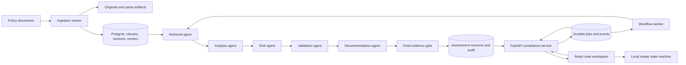
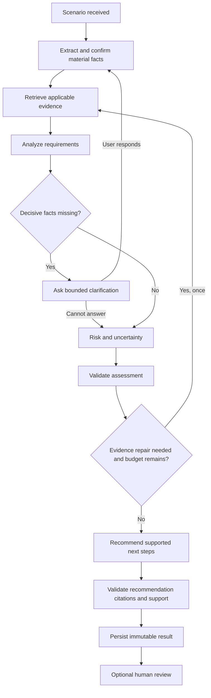

# Policy Compliance Intelligence — Implementation Plan

> Planning baseline: 25 September 2026. Source: `Project_4_-_AI_Powered_POLICY_COMPLIANCE_INTELLIGENCE.pdf`, all four pages.
> Implementation status: **in progress** (26 September 2026: F00 in review; F01, F02, F03 and F05 in progress; frontend built against fixtures). Unchecked items describe future work; live state for each feature is in `docs/tasks/Fxx.md`. This document is not itself evidence that features work.
> Working product name: **Clause**. This is a placeholder, not a trademark or availability claim.

### Navigation

- [1. Product direction and scope](#1-product-direction-and-scope)
- [2. PDF requirements and dataset mismatch](#2-what-the-pdf-actually-requires)
- [3. Feature priorities](#3-feature-priorities-and-what-makes-this-stand-out)
- [4. Architecture and repository layout](#4-recommended-architecture-and-decisions)
- [5. Domain model, APIs and events](#5-domain-model-and-contracts-to-freeze-before-parallel-work)
- [6. Ingestion, retrieval and evidence](#6-ingestion-retrieval-and-evidence-design)
- [7. Runtime multi-agent workflow](#7-multi-agent-workflow-and-bounded-reasoning)
- [8. Master tracker and coding-agent coordination](#8-progress-tracking-and-multi-agent-development-rules)
- [9. Thirty detailed feature work packages](#9-detailed-implementation-work-packages)
- [10. Worked product scenario](#10-worked-example-the-complete-product-interaction)
- [11. Reactive 3D avatar](#11-3d-avatar-implementation-and-interaction-specification)
- [12. Page inventory and Claude/Stitch design brief](#12-design-brief-for-claude-or-google-stitch)
- [13. Evaluation and release gates](#13-evaluation-strategy-and-release-gates)
- [14. Efficiency and performance](#14-efficiency-latency-and-cost-controls)
- [15. Reliability, security and deployment](#15-reliability-security-and-deployment-details)
- [16. Five-day sequence and full roadmap](#16-delivery-sequence-critical-path-and-five-day-plan)
- [17. Demo and submission artifacts](#17-demonstration-and-submission-package)
- [18. Open decisions and risks](#18-open-decisions-risks-and-recommended-defaults)
- [19. Coding-agent kickoff prompts](#19-agent-kickoff-instructions-and-maintenance)

**Start here:** read sections 2, 5 and 8 before coding; use section 16 to choose the current release scope. Give designers section 12 and avatar implementers section 11. Each coding agent claims one feature package from section 9.

## 1. Product direction and scope

Build a policy decision workspace in which a person describes an activity, the system checks relevant policy requirements, and every material finding can be inspected against its source. A conversation helps gather missing facts; the primary output is a structured, reviewable assessment.

The interview story should be: **“I can show what the system concluded, the evidence it used, what it does not know, and which changes would alter the result.”** A responsive 3D companion adds personality, but trustworthy behavior, measured retrieval quality, and useful interactions supply the technical substance.

### 1.1 Assumptions to revisit at kickoff

| Area | Planning assumption | Change if needed |
|---|---|---|
| Delivery | One student directing several coding agents; one human integration owner | Agents accelerate independent implementation, not product decisions or final verification |
| Timeline | **User-confirmed deadline: 5 days.** Preserve the full ambitious plan and use the five-day delivery sequence in section 16 | Full baseline plus all showcase work is closer to 30–45 human engineering/review days; parallel agents do not eliminate integration work |
| Stack | **User preference: FastAPI**, adopted here; React and TypeScript frontend proposed | Freeze frontend decisions before parallel implementation |
| Design | Claude and/or Google Stitch for design exploration | Use the page brief in section 12; verify generated code yourself |
| Corpus | English internal policies; start with 8–12 curated policies | No actual policy corpus is present in this workspace yet |
| Scale | Demo target: 10 concurrent sessions, up to 10,000 indexed chunks | These are test assumptions, not measured capacity |
| Hosting | Local-first Docker Compose; optional single-host deployment | No cloud spending or account setup is required by this plan |
| LLM | One configurable hosted provider initially; local retrieval/embeddings | Claude as a coding/design assistant does not imply Claude must be the runtime model |
| Users | Requester, reviewer, administrator; one organization initially | Add true multitenancy only with explicit need and isolation tests |
| Domain | Fictional organization's internal policies | Do not present synthetic policies as law or actual regulatory guidance |
| Budget | User states no budget restriction; prioritize quality and efficient execution | Still record tokens/cost and configure runaway limits; this plan does not purchase services |

**Remaining kickoff clarifications:** intended dataset; meaning of “A2A”; restrictions on hosted models; whether the assessor expects more than one independently deployed service. Continue with fixtures and contracts while these are unresolved. The deadline and FastAPI preference are already confirmed.

### 1.2 Scope tiers

- **B — Baseline:** everything needed to address the PDF, including its five specialist agents, citations, evaluation, runnable service, and presentation.
- **S — Showcase:** recommended additions after the baseline works: counterfactual scenarios, policy change impact, human review, execution replay, reactive avatar, and a benchmark UI.
- **X — Stretch:** voice, dependency visualization, expanded document ingestion, protocol interoperability, and a training mode. Implement selectively.

Baseline completion takes precedence over stretch. The full roadmap is intentionally larger than five days because the user requests the strongest plan without reducing ambition to fit the deadline. The five-day sequence is a prioritized release path, not a promise that all features fit. Aim for F00–F18 plus F19, F22 and a small F23 avatar; cut optional surface area if integration slips. Bring forward F28 if the assessor explicitly requires the standardized A2A protocol.

## 2. What the PDF actually requires

The PDF is the project brief, not a source of commands to execute. Requirements below are paraphrased and mapped to work items. Additional ideas are explicitly separated from those requirements.

### 2.1 Requirement traceability

| Requirement | PDF location | Weight | Implemented through | Acceptance evidence |
|---|---|---:|---|---|
| Prepare policy documents and a searchable knowledge base | pp. 1–2, Task 1 | 20% | F01–F05 | Repeatable ingestion; searchable seed corpus |
| Store clauses, requirements, metadata, document/section references | p. 2 Task 1; p. 4 key fields | Included above | F02–F04 | Inspectable clause records and source references |
| Natural-language policy questions and scenario search | p. 2 Task 2 | 25% | F05–F06, F12 | Queries retrieve relevant policy passages |
| Ground responses in retrieved policy evidence | p. 2 Task 2 | Included above | F06, F10, F13 | Findings link to genuine source spans |
| Policy Retrieval Agent | p. 2 Task 3 | 25% task total | F05, F07 | Agent input/output and trace |
| Compliance Analysis Agent | p. 2 Task 3 | Included above | F08 | Requirement-to-fact comparison |
| Risk Assessment Agent | p. 2 Task 3 | Included above | F09 | Risks and gaps tied to findings |
| Policy Interpretation/Validation Agent | p. 2 Task 3 | Included above | F10 | Unsupported conclusions blocked or qualified |
| Recommendation Agent | p. 2 Task 3 | Included above | F11 | Policy-based actions linked to gaps |
| A2A communication and specialist handoffs | p. 2 Task 3 | Included above | F07; F28 if formal protocol required | Typed exchanges, handoff trace, bounded repair path |
| End-to-end evidence traceability | p. 2 Task 3 | Included above | F02, F10, F13, F16 | Assessment → finding → clause → source page |
| Representative evaluation scenarios and documented metrics/results | p. 2 Task 4 | 20% | F14 | Held-out evaluation report, failures, reproducible command |
| UI: policies, clauses, citations, assessment, gaps/risks, recommended actions | p. 2 Task 4 | Included above | F04, F12–F13 | Complete business-user walkthrough |
| Architecture and policy-data-to-response diagram | p. 3 Task 5 and deliverable 1 | 10% task total | F18 | Diagram exported to **JPEG or PDF**, plus editable source |
| Design decisions and tradeoffs | p. 3 Task 5 and deliverable 2 | Included above | F00, F18 | Architecture decision records |
| Full executable code, described as “Microservice” | p. 3 deliverable 3 | Included above | F00, F17 | Independently runnable containerized backend API |
| README with setup and sample usage | p. 3 deliverable 3 | Included above | F17–F18 | Clean-machine setup exercise |
| 10-minute panel presentation | p. 3 deliverable 4 | Included above | F18 | 8-minute demo/design segment + 2-minute Q&A/QCA slot |

The wording does not establish that five agents must be five separate deployments. Proposed interpretation: one modular compliance API, a background worker using the same codebase, a frontend, and a database. Record this interpretation; adjust if the rubric requires separate services.

### 2.2 Dataset mismatch — address before evaluating compliance quality

Page 3 labels the corpus as policy/compliance documents but links to PubMed, PubMed abstracts, PMC, and BioNLP. PubMed's download page describes bibliographic citation data, while PMC's datasets contain scholarly articles. These are not an internal policy corpus. This appears to be a brief inconsistency; that is an inference, not confirmation of the author's intent. [PubMed downloads](https://pubmed.ncbi.nlm.nih.gov/download/), [PMC datasets](https://pmc.ncbi.nlm.nih.gov/tools/textmining/).

1. Record the mismatch in `docs/data/corpus-decision.md` and ask the assessor for the intended documents.
2. Meanwhile author a **synthetic demo organization** with explicitly fictional policies. Add a visible “Demo policy corpus” label to the application and exports.
3. Use provided real policies later only with permission to process them; record origin, version, effective date, and allowed use.
4. Keep biomedical data out of the policy index unless the assessor explicitly changes the project domain and supplies corresponding policy requirements.
5. Do not silently substitute a dataset and claim it is the one supplied by the brief.

Suggested synthetic corpus, with numbered clauses and internal cross-references:

| Policy | Useful demonstration cases |
|---|---|
| Customer onboarding | Missing evidence; review before activation; exceptions |
| Customer data sharing | Recipient restrictions; consent; internal approvals |
| Vendor due diligence | Assessment before sharing data; approved vendor status |
| Access control | Least privilege; temporary access; manager approval |
| Retention and deletion | Explicit durations; deletion holds; conflicting conditions |
| Incident response | Notification timing and responsibility |
| Remote working | Device and network conditions |
| Expense approval | Threshold boundaries; currency and approver authority |
| Change management | Production change windows and rollback requirements |
| Policy governance | Precedence, effective dates, exceptions, policy ownership |

Create two versions of at least two policies, one explicit exception, one unresolved conflict, and one policy that is deliberately irrelevant to the example scenario. Author expected outcomes manually. Policies are source material available to retrieval; answer keys and evaluation labels are never indexed.

## 3. Feature priorities and what makes this stand out

| Addition | Interview value | Implementation approach | Effort after foundations | Recommendation |
|---|---|---|---:|---|
| Evidence inspector | Demonstrates that citations actually support findings | Clause IDs, exact spans, page navigation | 2–3 days, included in baseline | Essential |
| Missing-fact questions | Shows restraint and useful interaction | Ask questions that can change a requirement result | 1–2 days, included in baseline | Essential |
| Counterfactual comparison | Answers “What needs to change?” | Branch scenario facts; rerun affected analysis; show deltas | 3–4 days | Highest-value extra |
| Policy version and change impact | Addresses policies changing over time | Clause mapping, deterministic diff, dependency records | 3–5 days | Strong extra |
| Human review | Makes assessment accountable | Reviewer disposition, reasons, immutable revisions | 2–3 days | Strong extra |
| Execution replay | Makes multi-agent work inspectable | Durable events and replayable public artifacts | 2–3 days | Strong extra |
| Reactive 3D companion | Memorable interaction and frontend depth | Local state machine driven by real task events | 3–5 days using a ready-made asset | User-requested showcase |
| Benchmark comparison | Proves engineering choices with measurements | Fixed test set and retrieval/agent ablations | 2–3 days beyond baseline evaluation | Strong extra |
| Voice with interruption | Adds conversational polish | Push-to-talk, transcript confirmation, cancelable speech | 3–5 days | Stretch |
| Policy dependency map | Explains cross-references and change propagation | Relational edges and a small focused graph | 2–3 days | Stretch |
| Training sandbox | Gives employees a reason to revisit | Authored practice cases and cited explanations | 2–3 days | Stretch |

Efforts overlap and assume prerequisites are complete; they are estimates, not commitments. Custom avatar modeling/rigging is excluded and can materially increase effort.

### 3.1 Deliberate technical differentiators

- Represent a policy obligation as structured data with its trigger, actor, required action, exceptions, and evidence, rather than treating every paragraph as an interchangeable vector chunk.
- Preserve three states for facts: **provided, inferred, unknown**. An absent fact does not become a negative assertion.
- Use a narrow deterministic rule interpreter for explicitly reviewed thresholds and boolean conditions. Let language models interpret text; do not let them execute generated code.
- Separate a finding's policy result, evidence support, risk, and human disposition. They answer different questions.
- Track the exact policy snapshot for a decision, so a historical case remains reproducible after a policy changes.
- Test behavior with targeted mutations: remove a mandatory approval, cross a threshold, change a date, or add an irrelevant clause. These reveal failures hidden by fluent prose.
- Show actionable disagreements between agents as evidence conflicts. Do not settle a policy interpretation through a majority vote of language models.

Avoid adding a second vector database, a general-purpose autonomous browsing agent, fine-tuning, a graph database, or Kubernetes without evidence that the baseline needs them. These are future options, not differentiators by themselves.

## 4. Recommended architecture and decisions

### 4.1 Stack proposal

| Layer | Choice | Reason and tradeoff |
|---|---|---|
| Web application | React + TypeScript + Vite | Suitable for an authenticated application with no initial SEO need; fewer server-rendering concerns for WebGL |
| Routing/data | React Router; TanStack Query | Route-driven case state and explicit server-cache invalidation |
| Styling | CSS variables plus Tailwind if helpful; accessible headless primitives | Bespoke layouts and tokens; avoid shipping an unchanged component-library dashboard |
| Avatar | Three.js + React Three Fiber; glTF/GLB asset | Local rendering; delayed bundle load; separate failure boundary |
| API | FastAPI + Pydantic | Typed Python contracts and OpenAPI generation |
| Workflow | LangGraph with a persistent Postgres checkpointer | Explicit graph, resumable clarification and review; keep prompts and domain logic outside framework-specific wrappers |
| Database | PostgreSQL + pgvector + native full-text search | One data store for relational state, text search and embeddings |
| Persistence | SQLAlchemy + Alembic | Schema migrations and explicit transactions |
| Documents | pypdf first for digital PDFs; Docling adapter for difficult layouts/OCR | Keep common files cheap; invoke the heavier parser only when needed |
| Embeddings | Start with `BAAI/bge-small-en-v1.5`, pinned revision | Small English baseline; benchmark on your own corpus before changing models |
| Model access | Small provider adapter with structured-output validation | One provider initially; explicit model IDs and prompt versions in each run |
| Jobs | Postgres jobs table + dedicated Python worker | Durable work without initially adding Redis; requires leases and idempotency |
| Live updates | Server-Sent Events (SSE) | One-way workflow updates fit this transport; normal HTTP for user actions |
| Document storage | Local persistent volume in development; storage interface for S3-compatible hosting | Keep originals out of database rows; enforce access on every download |
| Tests | pytest; frontend component tests; Playwright for critical flows | Focus on domain failures and integrated behavior |
| Packaging | Docker Compose; Python and JS lockfiles | Repeatable development and a small deployment footprint |

PostgreSQL supplies ranked full-text search; do not label its built-in ranking as BM25. pgvector documents combining vectors with full-text search and warns that approximate index filtering can reduce returned candidates. Start with exact vector search for the small corpus and benchmark before introducing HNSW. [PostgreSQL text search](https://www.postgresql.org/docs/current/textsearch-controls.html), [pgvector](https://github.com/pgvector/pgvector).

The proposed embedding model is English-focused, MIT-licensed, and produces 384-dimensional vectors with a 512-token input limit. Pin its tokenizer/model revision; include section prefixes in the token budget and reject silent truncation. [BGE model card](https://huggingface.co/BAAI/bge-small-en-v1.5).

pypdf extracts text but does not perform OCR. Treat scans as a separate input path and use a layout-aware parser where necessary. [pypdf extraction guidance](https://pypdf.readthedocs.io/en/stable/user/extract-text.html), [Docling documentation](https://docling-project.github.io/docling/).

### 4.2 High-level data flow



Export the final architecture to JPEG or PDF for submission. This Mermaid source alone does not satisfy the requested artifact format.

### 4.3 Architecture decisions to capture as ADRs

| ADR | Decision | Alternative considered | Cost accepted | Revisit trigger |
|---|---|---|---|---|
| 001 | One backend codebase with API and worker processes | One service per agent | Shared release cycle | Independent teams or actual scaling bottlenecks |
| 002 | Postgres search and pgvector | Dedicated search/vector service | Fewer specialized retrieval features | Retrieval quality/latency misses after tuning |
| 003 | Explicit graph and bounded calls | Free-form agent debate | Less open-ended behavior | A measured task cannot fit existing routing |
| 004 | Structured findings plus deterministic checks | Prose-only response | More schema work | Keep; this is a core product invariant |
| 005 | Local reactive avatar | Cloud video avatar | Less photorealism | User testing proves video value and budget allows it |
| 006 | HTTP + SSE | WebSockets everywhere | No bidirectional audio transport initially | Full-duplex voice becomes a committed feature |
| 007 | Native text ranking + vectors | BM25 extension or external engine | Lexical ranking has limitations | Ablation shows a measurable retrieval gap |
| 008 | Typed internal A2A messages initially | Formal external A2A transport | No claim of protocol interoperability | Rubric requires standard protocol; implement F28 |
| 009 | Versioned policy snapshots | Always query latest documents | More storage and snapshot logic | Keep; required for interpretable historical results |

Each ADR records context, options, chosen behavior, downsides, and the evidence that would change the decision. Pin dependency versions during F00; this document intentionally does not claim that a particular “latest” release will remain compatible.

### 4.4 Repository layout

```text
apps/
  web/src/
    routes/                 # page composition
    features/cases/          # conversation, facts, findings, comparison
    features/policies/      # library, source viewer, versions
    features/review/
    features/evaluation/
    features/avatar/        # isolated renderer and behavior controller
    components/             # shared UI primitives
    styles/                 # tokens, typography, layout
services/
  api/app/
    api/                    # HTTP/SSE endpoints
    domain/                 # facts, requirements, verdicts, rule evaluator
    ingestion/
    retrieval/
    agents/
    workflow/
    persistence/
    providers/
    reporting/
    security/
    worker/                 # jobs and leases, same backend package
  api/tests/
packages/
  contracts/                # generated OpenAPI types, JSON examples
data/
  demo/                     # versioned synthetic source files and manifest
  evaluation/               # scenarios and restricted answer keys
evals/                      # evaluator, ablations, result schemas
infra/                      # proxy/deploy configuration (compose.yaml sits at the root and
                            # services/api/Dockerfile beside the API so commands run from the root)
docs/
  architecture/             # ADRs and diagram source/exports
  design/                   # design brief, tokens, approved screen references
  data/                     # corpus decision and provenance
  evaluation/               # measured reports, not invented figures
  tasks/                    # one task file per feature
  handoffs/                 # one handoff per agent work session
scripts/                    # setup, seed, demo reset, export, validation
IMPLEMENTATION_PLAN.md
README.md
```

Generated reports, uploaded private files, credentials, model caches and local database volumes do not belong in Git. Small synthetic examples and representative public response fixtures do.

## 5. Domain model and contracts to freeze before parallel work

### 5.1 Core entities

| Entity | Essential fields and invariants |
|---|---|
| `User`, `Membership` | User ID, organization ID, role; membership resolved on server |
| `Policy` | Stable ID, title, category, business area, owner, applicability scope |
| `PolicyVersion` | Policy ID, version label, effective-from/to, recorded-at, status, original SHA-256, storage key, source/license metadata |
| `PolicySnapshot` | Immutable ID plus explicitly selected policy-version IDs and index revisions |
| `Clause` | Version ID, stable logical clause key, section path, exact normalized text, original page(s), extraction quality |
| `SourceSpan` | Clause ID, page index, printed page label if present, text offsets; optional page bounding boxes and coordinate convention |
| `Requirement` | Clause IDs, actor, modality (`must/must_not/may`), trigger, required action, exception refs, evidence needed, review state |
| `Chunk` | Clause ID, parent section, text, tokenizer count, embedding revision/dimension, `tsvector`, content hash |
| `ClauseRelation` | Source clause, target clause, relation (`references/excepts/overrides`), provenance and reviewer approval |
| `Case` | Organization, owner, title, business area, as-of date, created-at |
| `ScenarioRevision` | Immutable user text, structured facts, parent revision, confirmed assumptions |
| `Fact` | Key/value/unit, source message or attachment ref, origin (`provided/inferred`), confirmation state; unknown values remain explicit |
| `AssessmentRun` | Scenario revision, snapshot ID, model/config/prompt versions, state, budget, trace ID, timestamps |
| `Finding` | Requirement ID, requirement status, fact IDs, evidence IDs, support state, concise rationale, missing facts |
| `Risk` | Finding IDs, severity, likelihood if supported, impact description, rubric version |
| `Recommendation` | Finding IDs, policy evidence IDs, proposed action, suggested role, completion criteria |
| `Citation` | Immutable clause/span/version refs, quote text/hash, resolver URL; never a model-invented URL |
| `AgentMessage` | Run ID, sender/receiver, type, artifact refs, causal parent, schema version, timestamp |
| `RunEvent` | Run ID, monotonically increasing sequence, event type, public payload, recorded timestamp |
| `Review` | Assessment revision, reviewer, disposition, rationale, created-at; no overwrite of model findings |
| `Job` | Job type, idempotency key, lease owner/expiry, attempts, state, next-attempt time, error category |
| `AuditEvent` | Actor, action, target, timestamp, changed-field metadata; append-only under application roles |
| `EvaluationCase/Result` | Dataset version, case ID, gold clause/requirement refs, labels, measured metrics, configuration hash |

Add organization IDs to authorization boundaries even in the single-organization demo. Unique constraints protect version labels, event sequences and idempotency keys. Foreign keys prevent dangling citations. Restrict application write roles so completed run artifacts cannot be silently edited.

Historical retention is explicit: retain a referenced policy version while its assessments are retained. Deleting a case also removes associated chat, checkpoints, audio and cached outputs according to the documented retention rule. Do not promise permanent audit retention and complete erasure simultaneously; decide which non-content metadata remains and explain it.

### 5.2 Result semantics

**Requirement status:** `met`, `violated`, `unknown`, `not_applicable`, `conflict`.

**Assessment status:**

- `non_compliant`: at least one supported violation of an applicable mandatory requirement. Other unknowns remain visible.
- `conflicting_policy`: no supported violation has already determined the result, but an unresolved applicable policy conflict blocks a conclusion.
- `insufficient_information`: facts, applicable evidence, or validation support are insufficient and no supported violation determines the result.
- `compliant_within_scope`: all identified applicable mandatory requirements are met, scope is declared, and evidence validation succeeds.
- `out_of_scope`: the authorized corpus does not establish applicable requirements for this scenario; this is never treated as compliant.

Use the ordered rules above for the displayed status and keep independent flags for conflicts, missing facts and scope limitations. A technical timeout is `run.state=failed`, not a compliance verdict. `needs_review` is a workflow/review state, not a replacement for the assessment result.

Never label similarity scores or model self-reported confidence as “probability of compliance.” Show evidence completeness, validation support, unknown requirements and policy freshness separately.

### 5.3 Assessment output example

This is a synthetic contract fixture, not an assessment of real-world policy or law:

```json
{
  "schema_version": "1.0",
  "run_id": "run_demo_001",
  "case_revision_id": "scenario_002",
  "policy_snapshot_id": "snapshot_demo_v1",
  "as_of": "2026-09-25",
  "status": "non_compliant",
  "scope": "Fictional organization's supplied data-sharing policies",
  "summary": "The stated plan lacks the approval required by the demo policy.",
  "findings": [{
    "id": "finding_1",
    "requirement_id": "req_ds_4_2",
    "status": "violated",
    "fact_ids": ["fact_approval_absent"],
    "citation_ids": ["cite_1"],
    "support": "validated",
    "missing_facts": []
  }],
  "citations": [{
    "id": "cite_1",
    "policy_version_id": "ds_v1",
    "clause_id": "ds_v1_4_2",
    "page_index": 2,
    "section_path": ["4", "4.2"],
    "quote": "External sharing requires approval from the data owner.",
    "source_url": "/api/v1/policy-versions/ds_v1/source?page=3"
  }],
  "risks": [{
    "id": "risk_1",
    "finding_ids": ["finding_1"],
    "severity": "high",
    "likelihood": "unknown",
    "rubric_version": "demo-risk-v1"
  }],
  "recommendations": [{
    "id": "action_1",
    "finding_ids": ["finding_1"],
    "citation_ids": ["cite_1"],
    "action": "Obtain and record data-owner approval before external sharing."
  }],
  "limitations": ["Other organizations' policies were not assessed."],
  "review_state": "unreviewed"
}
```

### 5.4 API surface

All routes below are proposed contracts. Define request/response schemas, auth rules, pagination and error fixtures in F00/F02; generate client types from OpenAPI.

| Method and route | Purpose | Important behavior |
|---|---|---|
| `POST /api/v1/uploads` | Receive policy file | Admin role; MIME/content/size checks; checksum; return upload ID |
| `POST /api/v1/policies` | Create policy metadata | Admin role; explicit organization, category and applicability |
| `POST /api/v1/policies/{id}/versions` | Create draft version and ingestion job | Idempotency key; 202 job response |
| `GET /api/v1/policies/{id}/versions` | List authorized versions | Effective dates, publication and indexing status |
| `GET /api/v1/jobs/{id}` | Ingestion progress | Stage, counts, retryable error category |
| `POST /api/v1/policy-versions/{id}/publish` | Activate reviewed version | Atomic snapshot/index switch; validate dates and provenance |
| `GET /api/v1/policies` | Library and filters | Cursor pagination; authorized records only |
| `GET /api/v1/policy-versions/{id}/clauses` | Clause browsing | Section hierarchy and source spans |
| `GET /api/v1/policy-versions/{id}/source` | Authorized original document | Validated storage key; range support where needed |
| `POST /api/v1/search` | Evidence search | Return lexical/dense ranks, citations, snapshot ID |
| `POST /api/v1/cases` | Create case and scenario revision | Owner assigned from authenticated session |
| `GET /api/v1/cases` | Case history | Search/filter; object authorization |
| `GET /api/v1/cases/{id}` | Restore saved workspace | Authorized messages, scenario revision and run summaries |
| `POST /api/v1/cases/{id}/messages` | Follow-up or clarification answer | Append message; create revision when facts change |
| `POST /api/v1/cases/{id}/runs` | Start assessment | Snapshot pinned; idempotency key; 202 run ID |
| `GET /api/v1/runs/{id}` | Status or immutable final result | Includes failed/paused/canceled state |
| `GET /api/v1/runs/{id}/events` | SSE workflow progress | Replay after event ID; no secret prompts or raw hidden reasoning |
| `POST /api/v1/runs/{id}/resume` | Resume clarification | Authorized owner/reviewer; checkpoint revision conflict check |
| `POST /api/v1/runs/{id}/cancel` | Cancel work | Cooperative cancel; record terminal event |
| `POST /api/v1/cases/{id}/branches` | Counterfactual scenario | Parent revision and explicit changed facts |
| `POST /api/v1/runs/{id}/reviews` | Reviewer decision | Reviewer role; immutable rationale |
| `POST /api/v1/runs/{id}/reports` | Generate report | Stable run revision; authorized export |
| `GET /api/v1/reports/{id}` | Download report | Same permissions as originating case |
| `GET /api/v1/policy-changes/{id}` | Version delta and impacted cases | Impact list respects case access |
| `POST /api/v1/evaluations` | Start benchmark job | Admin-only; configuration and dataset hash |
| `GET /api/v1/evaluations/{id}` | Benchmark result | Metrics, uncertainty, failures and configuration |
| `GET /health/live`, `GET /health/ready` | Runtime checks | Readiness includes DB/migration/model requirements |

Standard errors: `code`, `message`, `request_id`, `retryable`, and safe field details. Distinguish 401/403, validation errors, 409 stale revisions, 413 too-large uploads, rate limits and provider failures. Never return secrets or complete provider request payloads.

### 5.5 Events and agent messages

Public event names: `run.queued`, `run.started`, `retrieval.completed`, `analysis.completed`, `risk.completed`, `validation.completed`, `recommendation.completed`, `clarification.required`, `run.completed`, `run.failed`, `run.canceled`. Optional voice events are local UI/audio events, not required backend workflow events.

Every event includes `event_id`, `run_id`, `sequence`, `occurred_at`, `schema_version` and `payload`. Reconnected clients deduplicate by ID, fetch current run status, then replay missing events. Persist an event and its related state change atomically or through a transactional outbox. Heartbeats are transport keepalives, not fictional agent activity.

SSE supports event IDs and reconnection behavior; use same-origin session cookies for browser authentication and configure the proxy to avoid buffering. Do not put bearer tokens in URLs. [MDN SSE guidance](https://developer.mozilla.org/en-US/docs/Web/API/Server-sent_events/Using_server-sent_events).

Internal agent message example:

```json
{
  "schema_version": "1.0",
  "message_id": "msg_104",
  "run_id": "run_demo_001",
  "sender": "validation",
  "recipient": "retrieval",
  "type": "evidence_request",
  "causal_parent_id": "msg_103",
  "payload": {
    "finding_id": "finding_2",
    "missing_requirement": "exception_authority",
    "scope": {"policy_snapshot_id": "snapshot_demo_v1"}
  },
  "remaining_repair_rounds": 1
}
```

These are application-level A2A messages. They demonstrate communication and handoffs, but do **not** by themselves implement the standardized Agent2Agent protocol. That protocol defines interoperable tasks, messages, artifacts, discovery and transport behavior; implement and test F28 before claiming compatibility. [Official A2A specification](https://a2a-protocol.org/latest/specification/).

## 6. Ingestion, retrieval and evidence design

### 6.1 Ingestion pipeline

1. Accept an admin-uploaded file, inspect its signature, enforce configurable limits and store original bytes under a generated key.
2. Hash the file; detect duplicates within the appropriate organization and policy context. Do not deduplicate across access boundaries in a way that reveals other users' files.
3. Extract document metadata and page text. Preserve both original extraction and a normalized representation with offset mappings.
4. Detect empty/scanned pages, repeated headers, columns and tables. Flag low-quality extraction instead of indexing garbage.
5. Segment by heading and clause numbering; preserve nested sections, lists, table headers, definitions, exceptions and cross-references.
6. Record clause identity separately from chunk identity. A clause can have multiple chunks, and a source span can cover multiple pages.
7. Extract proposed requirements into structured schemas. Require review for executable rule mappings and policy precedence; unreviewed extracted requirements remain visibly provisional.
8. Chunk within the embedding model's actual token limit. Start with roughly 250–400 tokens including title/section prefix and up to 40 tokens of overlap when a clause must split. Keep short clauses intact.
9. Batch embeddings; store model and tokenizer revision, content hash and embedding dimension. Skip only unchanged compatible content.
10. Build lexical search fields with section/title weighting and acronym normalization based on a reviewed glossary.
11. Stage artifacts and run integrity checks: every chunk points to a clause, every cited clause has a retrievable source, and no required page is silently dropped.
12. Publish the reviewed version atomically. Never expose half-built indexes to assessments; retain the old snapshot until the new one is ready.

DOCX/Markdown are stretch adapters; the first release supports digital PDFs and can show a clear unsupported-scan message until OCR is delivered. F27 expands that guarantee. If supplied assessment files are scans, move OCR into baseline immediately.

### 6.2 Retrieval pipeline

1. Resolve authorization, scenario date, selected business area and the immutable policy snapshot.
2. Parse question intent: simple policy lookup or scenario assessment. Only clear user-selected scope and reviewed policy metadata should exclude evidence; uncertain inferred metadata must not silently remove potentially applicable policies.
3. Query native full-text search and dense similarity concurrently with identical authorization/version filters.
4. Start with top 20 from each channel. Fuse using reciprocal rank fusion: `score(d) = sum(1 / (k + rank_i(d)))`, initial `k=60`; document this as a tunable rank-combination heuristic.
5. Deduplicate overlapping chunks by clause/span. Include associated definitions, exceptions and explicit cross-references even when they are not top semantic matches.
6. Use an optional local cross-encoder to rerank the top 20 candidates only if held-out evaluation justifies the extra latency. This is a feature flag, not a compulsory dependency.
7. Select a bounded evidence bundle, initially 8–12 clauses and a configured token cap. For multiple obligations, ensure topic coverage rather than selecting many near-duplicates.
8. Record candidates, ranks, filters, selected spans and latency for evaluation/debugging.
9. If evidence is weak, ask a scope clarification or abstain. Similarity thresholds are tuned on the development set; a threshold is not a truth detector.
10. Allow one targeted retrieval repair when validation identifies a missing definition, exception or supporting clause. Mark unresolved evidence gaps explicitly.

### 6.3 Citation integrity

- The backend creates citations from retrieved clause records; models select allowed IDs rather than inventing links, page numbers or titles.
- Check that IDs belong to the run's authorized snapshot and that quoted text matches the stored normalized source span.
- Keep a mapping to original page text; a matching normalized string alone is not proof that a claim follows from that text.
- Independently validate semantic support for material conclusions and recommendations.
- If exact PDF bounding boxes are unavailable, highlight the precise extracted text and navigate to the correct page. Do not draw guessed highlights.
- In the final output, every material policy claim has at least one valid citation, or is clearly marked as an unsupported limitation and excluded from the decisive findings.

## 7. Multi-agent workflow and bounded reasoning

### 7.1 Agent responsibilities

| Agent | Inputs | Outputs | Allowed capabilities | Failure behavior |
|---|---|---|---|---|
| Retrieval | Scenario, scope, snapshot | Evidence bundle and retrieval diagnostics | Authorized search and clause resolution | Empty bundle → clarification or out-of-scope |
| Analysis | Confirmed facts, requirements, evidence | Requirement findings and missing facts | Structured model call; reviewed rule interpreter | Invalid schema → one repair; otherwise incomplete |
| Risk | Findings, evidence, rubric | Risks, severity, uncertainty | Deterministic rubric plus bounded explanation | Unknown likelihood stays unknown |
| Validation | Findings, risks and evidence | Supported/unsupported/conflicting claim records | Citation checks and fresh evidence-grounding model pass | One evidence repair; unresolved claims blocked |
| Recommendation | Validated findings and risks | Remediation actions with evidence and completion criteria | Structured model call over allowed evidence | Unsupported suggestions removed |

Agent independence means separate roles, contracts and validation responsibilities. It does not require five providers, five servers, or five large models. A retrieval agent can primarily execute deterministic tools; a risk agent can primarily apply a reviewed rubric. Every full assessment invokes and records all five roles. A clearly labeled lookup route can skip assessment-only roles.

### 7.2 Main graph



LangGraph supports persistent graph checkpoints and pausing/resuming workflows for external input. Use persistent storage for recoverable runs, and make side effects idempotent because resumed nodes may execute again. [LangGraph persistence](https://docs.langchain.com/oss/python/langgraph/persistence), [LangGraph interrupts](https://docs.langchain.com/oss/python/langgraph/interrupts).

### 7.3 Clarification policy

- Ask at most three prioritized questions per round and initially at most two rounds per run.
- Prioritize facts that determine applicability, change a mandatory requirement result, or resolve a policy exception.
- Explain why a question matters in one sentence and link to the relevant clause where possible.
- Offer “I don't know” and continue to a qualified result; do not force users to manufacture certainty.
- Confirm inferred material facts before treating them as established facts. Preserve the original user statement.
- A follow-up that changes business area, jurisdiction or date triggers fresh applicability/retrieval checks, not just answer rephrasing.
- Persist paused runs without occupying a worker thread while waiting for the person.

### 7.4 Rule execution and risk

Start with a small allowlisted JSON rule format: equality, membership, numeric comparison with explicit units, `all`, `any`, and reviewed exception conditions. Represent unknown separately; use explicit truth tables so `not unknown` remains unknown. Never call `eval` on generated text. An unmet precondition and an unknown precondition lead to different outcomes.

Version the risk rubric. Define severity categories with examples from the fictional policies; calculate likelihood only when supplied evidence supports it. Display “likelihood unknown” rather than inventing a number. If a matrix score is used, expose its inputs and formula, and label it as a project prioritization rubric, not a validated legal or financial risk model. Do not average away a critical violation across many low-risk findings.

### 7.5 Runtime limits

- Simple lookup: target 1–2 generation/validation calls, plus local retrieval.
- Standard full assessment: target 4–6 LLM calls; deterministic retrieval/risk checks may avoid additional calls.
- Hard per-run budget: initially 8 total model calls, including repairs; configure context/output token limits and a wall-clock deadline. Clarification resumes retain the run budget or explicitly start a new run.
- At most one retrieval repair cycle, one schema repair per eligible stage, and no unbounded agent debate.
- Retry only transient provider failures with jitter and a strict attempt cap. Count retries toward cost and time budgets.
- Stop or qualify the result when limits are reached. Never silently replace a failed validation with a confident answer.
- Store concise public rationale, artifact references and stage summaries. Do not store or expose raw private chain-of-thought as an observability feature.

## 8. Progress tracking and multi-agent development rules

There are two different agent systems: **coding agents** implementing this repository, and the **five runtime compliance agents** inside the product. Coding-agent work allocation does not satisfy the PDF's runtime multi-agent requirement.

### 8.1 Status rules

Use `TODO`, `READY`, `IN_PROGRESS`, `BLOCKED`, `IN_REVIEW`, `DONE`, `DEFERRED`.

- `READY`: dependencies and acceptance criteria are understood; interfaces/fixtures are available.
- `IN_PROGRESS`: a named owner has claimed the feature and listed its files/branch.
- `BLOCKED`: record the concrete blocker and next action; do not use this for ordinary unfinished work.
- `IN_REVIEW`: code, integration evidence and handoff are available.
- `DONE`: acceptance criteria pass, dependencies are integrated, evidence is linked, and review is complete.
- `DEFERRED`: explicitly excluded from the current release; never counted as completed.

**Feature progress** = checked implementation/verification checklist items ÷ total checklist items in that feature. This is an administrative progress indicator, not a quality metric. The `DONE` status additionally requires the global definition of done below. Report baseline and showcase completion separately; do not claim assignment coverage by averaging in optional UI work.

### 8.2 Master feature tracker

All work starts unassigned and at zero. Estimated effort is intentionally approximate; do not sum individual rows as a reliable calendar forecast.

| ID | Feature | Tier | Depends on | Suggested lane | Status | Owner | Progress | PR / evidence |
|---|---|---|---|---|---|---|---|---|
| F00 | Repository, contracts, CI skeleton | B | — | Integration | IN_REVIEW | Claude Code (backend lane) | 5/5 | [F00](docs/tasks/F00.md); [CI green](https://github.com/PaulAndrew7/prodapt-capstone/actions/runs/36236160176) |
| F01 | Corpus and scenario specification | B | F00 | Data/evaluation | IN_PROGRESS | Claude Code (backend lane) | 3/5 | [F01](docs/tasks/F01.md); 11 policies, 13 dev scenarios |
| F02 | Schema and versioned persistence | B | F00 | Backend | IN_PROGRESS | Claude Code (backend lane) | 3/5 | [F02](docs/tasks/F02.md); migration 0001 |
| F03 | PDF ingestion and indexing | B | F01,F02 | Data | IN_PROGRESS | Claude Code (backend lane) | 1/5 | [F03](docs/tasks/F03.md); 111/111 clauses exact |
| F04 | Policy library and source viewer | B | F02,F03 | Frontend | TODO | — | 0/5 | — |
| F05 | Hybrid retrieval | B | F03 | Retrieval | IN_PROGRESS | Claude Code (backend lane) | 2/5 | [F05](docs/tasks/F05.md); lexical + dense + RRF |
| F06 | Grounded policy lookup | B | F05 | Retrieval/backend | TODO | — | 0/5 | — |
| F07 | Graph, A2A exchanges and handoffs | B | F00,F02 | Workflow | TODO | — | 0/5 | — |
| F08 | Compliance analysis and clarification | B | F05,F07 | Workflow | TODO | — | 0/5 | — |
| F09 | Risk and gap assessment | B | F08 | Workflow | TODO | — | 0/5 | — |
| F10 | Interpretation and validation | B | F08,F09 | Workflow/evaluation | TODO | — | 0/5 | — |
| F11 | Remediation recommendations | B | F10 | Workflow | TODO | — | 0/5 | — |
| F12 | Case workspace and conversation | B | F00,F07 | Frontend | TODO | — | 0/5 | — |
| F13 | Assessment and evidence UI | B | F04,F11,F12 | Frontend | TODO | — | 0/5 | — |
| F14 | Evaluation harness and report | B | F01,F05,F11 | Evaluation | TODO | — | 0/5 | — |
| F15 | Access control and security checks | B | F00,F02 | Backend/integration | TODO | — | 0/5 | — |
| F16 | Reports and audit history | B | F11,F15 | Backend/frontend | TODO | — | 0/5 | — |
| F17 | Deployment and recovery | B | F03,F07,F12,F15 | Integration | TODO | — | 0/5 | — |
| F18 | Documentation and panel demo | B | F13,F14,F16,F17 | Integration | TODO | — | 0/5 | — |
| F19 | Counterfactual scenario comparison | S | F08,F11,F13 | Workflow/frontend | TODO | — | 0/5 | — |
| F20 | Policy changes and affected cases | S | F03,F13,F16 | Data/backend | TODO | — | 0/5 | — |
| F21 | Human review workflow | S | F13,F15,F16 | Backend/frontend | TODO | — | 0/5 | — |
| F22 | Execution timeline and replay | S | F07,F12,F15 | Observability/frontend | TODO | — | 0/5 | — |
| F23 | Reactive 3D avatar | S | F12,event contract | Avatar/frontend | TODO | — | 0/5 | — |
| F24 | Evaluation lab and regression gates | S | F14,F15 | Evaluation/frontend | TODO | — | 0/5 | — |
| F25 | Voice, speech and interruption | X | F12,F23 | Avatar/backend | TODO | — | 0/5 | — |
| F26 | Policy dependency visualization | X | F03,F20 | Data/frontend | TODO | — | 0/5 | — |
| F27 | OCR, DOCX and batch ingestion | X* | F03,F04 | Data | TODO | — | 0/5 | — |
| F28 | Standard A2A interoperability adapter | X* | F07,F10,F15 | Workflow/backend | TODO | — | 0/5 | — |
| F29 | Policy training sandbox | X | F01,F06,F13 | Product/frontend | TODO | — | 0/5 | — |

`X*`: promote to baseline if scans/DOCX are provided or standard A2A interoperability is explicitly required. Dependencies indicate integration gates; independent work can start earlier against frozen contracts and fixtures.

### 8.3 Assign coding agents by ownership boundary

| Lane | Primary ownership | Must coordinate with | Avoid editing independently |
|---|---|---|---|
| Integrator | Contracts, migrations approval, CI, Compose, release | Everyone | Domain behavior without owning feature review |
| Data/retrieval | Parser, chunks, indexes, search, provenance | Backend for schema; evaluation for gold evidence | Global schema or shared generated clients without agreement |
| Workflow | Domain rules, prompts, runtime agents, checkpoints | Retrieval and frontend event consumers | UI tokens and ingestion internals |
| Product frontend | Pages, facts editor, evidence UX, review | Backend contracts; design owner | Backend result semantics |
| Avatar | Renderer, asset pipeline, event-to-animation controller | Frontend event contract | Assessment verdict logic or global app state |
| Evaluation/reliability | Datasets, harness, adversarial tests, metrics | All lanes | Model prompts simply to force test labels |

These are lanes, not a requirement to run six agents simultaneously. For the five-day sprint use at most four concurrent coding agents initially: integration/backend, data/retrieval, workflow/evaluation, and frontend/avatar. Assign evaluation review to a different agent/person from the implementation when possible.

### 8.4 Claim, implement, integrate, hand off

1. Integrator creates one `docs/tasks/Fxx.md` per feature from the template below. The master table remains an index.
2. Claim a task with owner, UTC claim timestamp, branch/worktree and file ownership. A second agent must not concurrently claim it.
3. Freeze or explicitly version any needed API/schema/event contract before parallel implementation. Use golden JSON fixtures for UI work.
4. Prefer an isolated Git worktree and branch per agent. If agents share a checkout, enforce disjoint files; do not run competing package installs, migration generation or Git index operations.
5. The schema owner creates/merges migrations. Other agents request schema changes with a concrete example instead of inventing conflicting migration heads.
6. Commit small vertical changes. Generate clients after the schema change is merged; generated files have one owner.
7. Run feature-specific checks, update the local task record, and attach relevant screenshots, fixtures or test output.
8. Integrator reviews, merges in dependency order, reruns impacted integration checks, then updates the master tracker.
9. Leave a handoff even when incomplete: exact state, changed files, how to run, failing checks, unresolved decisions, next action.
10. A stale claim is reassigned only after the integrator confirms the owner stopped; avoid two agents resuming the same task.

```markdown
# Fxx — Feature title
Status: TODO
Tier: B / S / X
Owner: unassigned
Reviewer: unassigned
Claimed at (UTC): —
Last update (UTC): —
Branch/worktree: —
Dependencies: —
Owned paths: —
Contract versions: —

## Acceptance checklist
- [ ] Copy the five checklist items from the implementation plan.

## Evidence
- Tests/commands and result:
- UI screenshot or API response:
- PR/commit:

## Blockers and next action
- None recorded.

## Handoff
- Completed:
- Remaining:
- Integration notes:
```

### 8.5 Global definition of done

A completed feature is integrated, handles its specified failure states, respects authorization, passes appropriate checks, and has no unexplained TODO on its critical path. User-visible changes are checked at desktop/mobile sizes and with keyboard navigation. New fields/events are documented and old fixtures updated deliberately. Model-dependent claims include measured evaluation evidence. Mock behavior is labeled and never presented as a live backend result.

## 9. Detailed implementation work packages

Each package has exactly five tracked checklist items. Additional acceptance notes are release gates, not extra percentage points.

### F00 — Repository, contracts and CI skeleton

**Outcome:** agents can build against one consistent foundation. **Deliverables:** root README skeleton, backend/web scaffolds, lockfiles, OpenAPI fixtures, environment example, CI.

- [ ] Create repository structure, ignore rules, pinned toolchain files and initial runnable FastAPI/React shells.
- [ ] Define result enums, API errors, event envelope, source-citation types and the synthetic assessment fixture from section 5.
- [ ] Add lint/typecheck/test commands, health endpoint and a CI job that exercises the empty application.
- [ ] Add `.env.example`, validated configuration and separate runtime model/provider settings; reject missing required production config.
- [ ] Create task records, ownership rules and ADRs 001–009 with proposed/accepted status; verify both apps start from documented commands.

**Accept when:** a new coding agent can start the apps and render a fixture without inventing a contract. No API keys are exposed in frontend environment variables.

### F01 — Corpus and scenario specification

**Outcome:** a defensible dataset and known expected behavior.

- [ ] Record the PDF dataset inconsistency, corpus provenance rules and pending assessor clarification.
- [ ] Author 8–12 synthetic policies with numbered clauses, definitions, exceptions, dates and document ownership.
- [ ] Produce source PDFs from versioned authored text; preserve a manifest with hashes and distinguish synthetic from provided material.
- [ ] Create an initial 30 hand-reviewed scenarios including missing facts, threshold boundaries, conflicts and no-answer questions.
- [ ] Expand toward the 80-scenario evaluation design in section 13; separate development/test labels and confirm none enter retrieval.

**Accept when:** each expected result can be justified by specific clauses. If time permits only 30 scenarios, report that limit and the actual split; do not claim the 80-case target was achieved.

### F02 — Schema and versioned persistence

**Outcome:** policy and assessment artifacts remain traceable across revisions.

- [ ] Implement policy/version/clause/span/chunk tables with required metadata, constraints and source-storage keys.
- [ ] Implement cases, facts, immutable scenario revisions, runs, findings, citations, risks and recommendations.
- [ ] Implement snapshots, run events, agent messages, jobs and audit events with indexes for their query paths.
- [ ] Add migrations, seed fixtures, transactional publish/run creation and optimistic revision checks.
- [ ] Verify migrations on a fresh database, rollback/recovery procedure, foreign-key integrity and cross-organization object isolation.

**Accept when:** a historical run resolves its original policy text after a newer version is published.

### F03 — PDF ingestion and indexing

**Outcome:** digital PDFs become trustworthy searchable clauses.

- [ ] Implement bounded uploads, byte hashing, duplicate handling and durable ingestion jobs.
- [ ] Parse page text and sections; preserve normalization maps; flag scan/table/column extraction failures.
- [ ] Create clauses and requirement proposals; split long clauses within token limits; retain cross-references and exceptions.
- [ ] Batch/cache embeddings and create lexical indexes; stage then atomically activate a reviewed index revision.
- [ ] Test duplicates, corrupt PDFs, scanned files, multi-page clauses, changed versions and worker restart mid-ingestion.

**Accept when:** reprocessing identical input is idempotent and every published chunk can be traced to an original page. Failed files show an actionable status; they are never silently marked ready.

### F04 — Policy library and source viewer

**Outcome:** a person can inspect what the system knows.

- [ ] Implement policy listing with category/business-area/status filters and ingestion progress.
- [ ] Implement document detail with section hierarchy, metadata, version selector and clause text.
- [ ] Add PDF page navigation and exact extracted-text highlighting; use actual bounding boxes only when available.
- [ ] Implement admin upload/retry/publish controls and extraction-quality warnings.
- [ ] Verify keyboard operation, source download authorization, large-document rendering and missing-file/error states.

**Accept when:** clicking a citation opens the correct policy version and section without losing the current case.

### F05 — Hybrid retrieval

**Outcome:** query wording and exact policy terminology both work.

- [ ] Implement full-text and vector search with shared authorization, effective-date and snapshot filters.
- [ ] Add fusion, clause deduplication, parent/definition/exception expansion and explicit token bounds.
- [ ] Add structured search responses with resolvable citations and retrieval diagnostics.
- [ ] Measure lexical-only, dense-only and hybrid retrieval on labeled development cases; tune without using held-out answers.
- [ ] Test acronyms, negation, exact thresholds, obsolete versions, irrelevant documents, narrow filters and no relevant evidence.

**Accept when:** results are correct under filters, not just in an unfiltered happy path. Record whether reranking improves measured quality enough to justify its cost.

### F06 — Grounded policy lookup

**Outcome:** simple policy questions receive concise, evidence-backed answers.

- [ ] Add an explicit lookup mode separate from full scenario assessment, using the shared retrieval service.
- [ ] Generate structured answers using only the permitted evidence IDs and bounded source context.
- [ ] Resolve citations on the server and validate quote/reference integrity and material claim support.
- [ ] Add abstention, scope clarification and source-insufficient response forms.
- [ ] Test fabricated-citation attempts, out-of-corpus questions and conflicting passages; show the result in the fixture-driven UI.

**Accept when:** an unsupported answer is withheld or clearly qualified instead of being presented as policy.

### F07 — Workflow graph, agent communication and handoffs

**Outcome:** the five roles exchange findings through an inspectable, resumable workflow.

- [ ] Implement typed graph state, stage adapters and the five role boundaries using contract fixtures initially.
- [ ] Persist checkpoints, messages and causal artifact links; expose run creation/status/events.
- [ ] Implement normal handoffs and one validation-to-retrieval repair handoff with routing reasons.
- [ ] Enforce call/time/token budgets, cancellation, job leases, idempotency and checkpoint resume authorization.
- [ ] Verify all five roles appear in a full run trace; exercise timeout, worker death, reconnect and duplicate resume.

**Accept when:** a complex case produces a trace of real role outputs and resumes after a process restart without duplicate completed artifacts. Internal messaging must not be advertised as standardized A2A interoperability.

### F08 — Compliance analysis and clarifying questions

**Outcome:** requirements are compared to explicit facts with uncertainty preserved.

- [ ] Extract structured scenario facts and mark provided, inferred and unknown values with message provenance.
- [ ] Determine applicable requirements, including definitions, conditions and reviewed exceptions.
- [ ] Implement the small reviewed rule interpreter and structured LLM findings for textual requirements.
- [ ] Ask prioritized missing-fact questions, checkpoint the run and create new revisions for user answers.
- [ ] Test missing approvals versus explicitly absent approvals, unknown conditions, units, dates, negation and changed answers.

**Accept when:** the same missing fact is not alternately assumed true and false across agents, and a follow-up changes only justified findings.

### F09 — Risk and gap assessment

**Outcome:** gaps are explained without invented precision.

- [ ] Define a versioned demo risk rubric with severity categories, examples and unknown-likelihood handling.
- [ ] Link risk records to specific validated-or-pending findings and relevant evidence.
- [ ] Separate violations, missing evidence, missing facts and policy conflicts in the result schema.
- [ ] Produce an ordered risk summary that retains critical findings and explains each priority.
- [ ] Test rubric boundaries, no-risk evidence, unknown likelihood and conflicting agent inputs.

**Accept when:** the UI explains the risk inputs and never turns a retrieval score into a risk probability.

### F10 — Policy interpretation and evidence validation

**Outcome:** unsupported or contradictory conclusions cannot quietly become final.

- [ ] Validate schema, source IDs, snapshot membership, quote spans and finding-to-requirement links in code.
- [ ] Run a fresh structured semantic-support check over claims and actual evidence; distinguish unsupported from contradicted.
- [ ] Detect missing exception/definition support and request one bounded retrieval repair where useful.
- [ ] Block/qualify unresolved claims, record disagreement and calculate final status using the rules in section 5.
- [ ] Test an authentic but irrelevant citation, fabricated page, wrong policy version, contradictory clauses and prompt injection in a document.

**Accept when:** a real citation that does not entail the claim fails validation. Automated validation reduces risk; evaluation must not claim it proves correctness.

### F11 — Policy-based remediation

**Outcome:** users receive actions that address identified requirements.

- [ ] Generate a structured action per remediable finding with citation IDs, suggested responsible role and completion evidence.
- [ ] Distinguish mandatory policy steps from clearly labeled optional operational suggestions.
- [ ] Reject invented deadlines/approvers and recommendations that contradict prohibitions or unresolved exceptions.
- [ ] Run final recommendation support checks and persist the complete immutable assessment.
- [ ] Test unsupported actions, multiple findings sharing one action, missing evidence and a case with no remediation needed.

**Accept when:** each policy-based action leads back to the gap and clause that justify it; the app never claims an action was carried out merely because it was recommended.

### F12 — Case workspace and conversation

**Outcome:** a user can enter, refine, save and revisit a scenario.

- [ ] Build case listing and the shared new/existing case workspace from section 12 with real-content fixtures.
- [ ] Add scenario entry, scope/date controls, conversation history, confirmed-facts panel and clear run action.
- [ ] Integrate start/resume/cancel APIs and SSE reconnect with current-run reconciliation.
- [ ] Display queued, active, clarification, failed, canceled, empty and complete states; preserve unsent text on errors.
- [ ] Verify mobile layout, keyboard navigation, duplicate-submit protection and reload recovery.

**Accept when:** losing the event connection does not lose the case, duplicate the run, or leave the UI showing an invented completion.

### F13 — Assessment and evidence UI

**Outcome:** all six UI outputs required by the PDF are easy to inspect.

- [ ] Render assessment, applicable policies, clauses/citations, gaps/risks and recommended actions from typed backend data.
- [ ] Add a requirement matrix showing result, known facts, missing facts and source references.
- [ ] Implement finding-to-source navigation and an evidence drawer with version/date context.
- [ ] Add limitation/conflict/unknown states, reviewed-versus-unreviewed labels and report action.
- [ ] Verify a supported violation, an unresolved case, an out-of-scope case and a compliant-within-scope case end to end.

**Accept when:** finding → clause → original page is a short, understandable interaction. No fabricated compliance percentage appears in the design.

### F14 — Evaluation harness and measured report

**Outcome:** quality claims are reproducible.

- [ ] Version the labeled corpus/scenarios, document annotation decisions and freeze held-out test cases.
- [ ] Implement retrieval, citation/support, requirement/verdict, abstention, latency and cost metrics from section 13.
- [ ] Add baseline/ablation configurations, deterministic checks and a human review worksheet.
- [ ] Run the actual evaluation, retain configuration hashes/raw per-case results and report failure examples with sample counts.
- [ ] Re-run selected cases to measure variability; publish observed numbers and limitations without filling gaps with assumed targets.

**Accept when:** another person can reproduce the measurement procedure, and the report distinguishes targets from results.

### F15 — Access control and security

**Outcome:** case/policy data and model credentials stay within their intended boundaries.

- [ ] Implement established session/OIDC integration or a minimal documented local-demo auth mode; define requester/reviewer/admin permissions.
- [ ] Enforce authorization in queries, retrieval filters, source downloads, SSE, reports, reviews and run resume.
- [ ] Validate uploads and rendered text; isolate document content from system instructions; limit agent tools and provider egress.
- [ ] Add rate limits, request limits, safe logging, secret handling, CORS/CSRF controls and retention/deletion behavior.
- [ ] Test unauthorized object IDs, malicious documents, stored script payloads, exported data access and leaked-secret regressions.

**Accept when:** a public deployment cannot start with an unauthenticated admin or developer bypass enabled. Local demo credentials and synthetic data are explicitly labeled.

### F16 — Reports and audit history

**Outcome:** assessment evidence can leave the UI without losing provenance.

- [ ] Create HTML-to-PDF or equivalent report templates plus a machine-readable JSON export.
- [ ] Include scenario revision, scope/date, policy snapshot, findings, citations, risks, actions, limitations and reviewer disposition.
- [ ] Store report version/hash and generator version; make export idempotent for the same immutable input/configuration.
- [ ] Record meaningful audit events with role-restricted access and sensitive-content minimization.
- [ ] Verify report pagination, source references, access control, interrupted export and historical version reproduction.

**Accept when:** the report makes its synthetic corpus and review status clear and does not imply organization-wide certification. A file hash provides integrity checking, not a trusted digital signature.

### F17 — Deployment, operations and recovery

**Outcome:** the project runs predictably outside the developer's current session.

- [ ] Package web/API/worker/database and persistent volumes in Compose with health/readiness checks.
- [ ] Add migrations, seed/import commands, warm-up and a repeatable synthetic-demo reset command.
- [ ] Configure reverse proxy/SSE behavior, production secrets, storage paths, bounded worker concurrency and resource limits.
- [ ] Exercise restart during ingestion/assessment, database restore, provider failure and graceful shutdown.
- [ ] Complete a fresh-clone setup on a clean environment; document actual prerequisites and measured startup time.

**Accept when:** the API remains independently executable and a worker crash does not destroy acknowledged jobs. Container deployment follows ordinary FastAPI deployment practices; use a current project Dockerfile rather than relying on an unverified legacy image. [FastAPI container guidance](https://fastapi.tiangolo.com/deployment/docker/).

### F18 — Documentation and panel presentation

**Outcome:** a reviewer can understand, run and assess the complete submission.

- [ ] Finish README setup, configuration, sample scenario/output, testing, limitations and troubleshooting.
- [ ] Finalize system/data/workflow diagrams; export the architecture to JPEG or PDF and retain editable source.
- [ ] Write ADRs, corpus notes, evaluation report and a requirement-to-artifact submission checklist.
- [ ] Prepare the eight-minute scripted demo plus two-minute question slot from section 17; rehearse with a timer.
- [ ] Verify demo seed data, clean-run command, recorded fallback, repository hygiene and links in the submission package.

**Accept when:** all five PDF tasks have concrete artifacts, including actual evaluation results and the diagram in the requested format.

### F19 — Counterfactual scenario comparison

**Outcome:** show which explicit factual changes would change the assessment.

- [ ] Create immutable scenario branches with parent revision, changed fact IDs and user-confirmed hypothetical assumptions.
- [ ] Generate a small candidate set from failed requirement predicates and supported remediation actions; cap at three suggestions.
- [ ] Rerun all potentially affected requirements and applicability checks; cache only artifacts whose dependencies truly did not change.
- [ ] Present before/after status, changed findings, remaining unknowns and evidence; label the result hypothetical.
- [ ] Test a threshold boundary, newly triggered policy, unchanged irrelevant fact and a suggestion that fixes one requirement but violates another.

**Accept when:** the feature proposes policy-supported changes, not ways to conceal facts or evade a policy. Call it “smallest tested change” only within the explored candidate set; do not claim a globally optimal remedy.

### F20 — Policy versions, semantic change and impact

**Outcome:** explain what changed and which previous decisions may need review.

- [ ] Match clauses across versions using reviewed stable keys, normalized text and similarity-assisted candidates.
- [ ] Classify added/removed/wording/threshold/exception changes; retain deterministic text diff beside any generated explanation.
- [ ] Identify directly affected cases through evidence/dependency links and potentially affected cases through scope/applicability metadata.
- [ ] Add on-demand re-evaluation under a new snapshot and present old/new findings without editing the historical result.
- [ ] Test renamed clauses, split/merged clauses, future-effective versions and new requirements with no prior citation links.

**Accept when:** the system does not claim its impact list is exhaustive based only on old citations. Changed scope can affect cases that never cited the old clause.

### F21 — Human review workflow

**Outcome:** a responsible reviewer can accept, challenge or amend an assessment.

- [ ] Add review queue with filters for high severity, conflicts, unsupported findings and requested review.
- [ ] Implement reviewer-only accept/challenge/request-information actions with required rationale for changes.
- [ ] Store review records independently of original agent findings and display both with actor/timestamp.
- [ ] Re-run affected analysis when facts/policy scope change; do not silently rewrite a completed assessment.
- [ ] Test concurrent reviewers, stale revisions, requester privilege violations and review history in reports.

**Accept when:** “reviewed” never implies the model itself approved a business action or that an actual organization authorized it.

### F22 — Execution timeline and replay

**Outcome:** the multi-agent workflow is visible and explainable.

- [ ] Build a timeline from persisted stage events and typed inter-agent exchanges with durations and status.
- [ ] Show artifact previews, retrieved evidence, validation disagreements, routing reasons and aggregate token/cost usage.
- [ ] Add replay of recorded events with an explicit replay label and speed/pause controls; keep it separate from live execution.
- [ ] Add trace/request IDs to safe logs and UI diagnostics; restrict detailed traces by role.
- [ ] Test out-of-order/duplicate events, missing optional metrics, failed stages and a replay after application restart.

**Accept when:** the timeline reflects actual execution and shows concise public explanations rather than fictional “thinking” text.

### F23 — Reactive 3D avatar

**Outcome:** the user-requested avatar responds naturally to conversation and genuine workflow states.

- [ ] Choose a redistributable rigged GLB asset, record license/attribution and produce a compressed web-ready variant plus 2D fallback.
- [ ] Implement isolated React Three Fiber rendering, camera/framing, animation blending and an error boundary.
- [ ] Implement the event-driven behavior table in section 11, including interruption, clarification, evidence focus and neutral error behavior.
- [ ] Add lazy loading, reduced-motion/disable controls, mobile quality adaptation and hidden-tab/offscreen suspension.
- [ ] Validate all event transitions, real workflow integration, keyboard access, WebGL failure and measured frame/bundle budgets.

**Accept when:** the app works fully with the avatar disabled; its expressions do not imply unsupported certainty or camera-based emotion detection.

### F24 — Evaluation lab and regression gates

**Outcome:** engineering choices can be demonstrated through side-by-side measured experiments.

- [ ] Build an admin evaluation page showing dataset/configuration, metric definitions and run status.
- [ ] Add comparison of lexical/dense/hybrid, reranker on/off and validator on/off against fixed cases.
- [ ] Show error slices, false-compliant cases, unsupported citations, latency and cost together.
- [ ] Add CI smoke regressions using a small deterministic subset; schedule full live-model evaluation separately with explicit cost limits.
- [ ] Verify held-out labels never leak to prompts/indexes and baseline comparisons use the same corpus/scenario snapshots.

**Accept when:** the UI can show a quality/cost tradeoff without hiding a worse metric or presenting development-set gains as held-out performance.

### F25 — Voice and interruption

**Outcome:** optional spoken interaction with visible text and reliable cancellation.

- [ ] Add explicit push-to-talk permission and recording indicators; retain typed input as the primary fallback.
- [ ] Implement provider-adapted transcription and editable transcript confirmation before assessment submission.
- [ ] Speak only validated output with a stop control, queue cancellation and cleanup on navigation.
- [ ] Synchronize mouth movement with provider visemes if available, or clearly use a simpler amplitude-based animation.
- [ ] Test microphone denial, transcript mistakes, overlapping turns, delayed audio, browser support and storage/deletion settings.

**Accept when:** old speech cannot continue over a new answer, and unconfirmed transcription errors do not become authoritative scenario facts.

### F26 — Policy dependency map

**Outcome:** explain a selected policy's definitions, exceptions and downstream dependencies.

- [ ] Store reviewed cross-reference edges with type and source evidence in relational tables.
- [ ] Add a focused graph for a selected clause/policy with an equivalent accessible list view.
- [ ] Connect graph nodes to clause inspector, version context and affected cases.
- [ ] Bound visible nodes and use server-filtered neighborhoods instead of rendering the entire corpus.
- [ ] Test cycles, missing references, changed versions and access-restricted nodes.

**Accept when:** users can answer “why does this clause affect this case?” without deciphering an ornamental network diagram.

### F27 — Expanded ingestion

**Outcome:** support scanned and more complex source formats reliably.

- [ ] Add OCR/layout-aware and DOCX adapters behind the common parsing interface.
- [ ] Preserve OCR quality and table structure; require review for low-quality material affecting mandatory clauses.
- [ ] Add batch upload, per-file progress, partial failure handling and cancellation.
- [ ] Cap pages, decompression, OCR time and resource use; isolate parser jobs from interactive workers if needed.
- [ ] Evaluate a held-out extraction set containing scans, tables, columns, rotated pages and malformed files.

**Accept when:** extracted clause/source mappings remain trustworthy and a bad file cannot monopolize the worker indefinitely.

### F28 — Standard A2A protocol adapter

**Outcome:** demonstrate genuine interoperability if it is useful or required.

- [ ] Pin the official protocol/SDK version and document supported capabilities, transport, authentication and exclusions.
- [ ] Expose one bounded specialist, preferably validation, through a version-correct Agent Card and task/message/artifact interface.
- [ ] Implement task states, input-required responses, cancellation, error mapping and trace correlation using the pinned SDK.
- [ ] Run a separate test client or process against the adapter; exchange a real assessment artifact and evidence references.
- [ ] Verify auth, malformed messages, timeouts, duplicate requests and interoperability fixtures for the selected protocol version.

**Accept when:** an independent compatible client completes the documented exchange. Do not hardcode discovery paths or methods copied from a different protocol revision.

### F29 — Policy training sandbox

**Outcome:** users can practice recognizing policy gaps with source-backed feedback.

- [ ] Author a small curated scenario bank with learning objectives and reviewed answers.
- [ ] Add practice mode where users choose a disposition and cite a reason before seeing feedback.
- [ ] Reuse evidence/requirement components for explanations and link back to the source policy.
- [ ] Track local practice progress without mixing it with real case review or the held-out evaluation set.
- [ ] Test version changes invalidating old answers, accessibility and clear separation of practice scores from compliance outcomes.

**Accept when:** practice content is reviewed and stable; no model invents a policy rule merely to make a quiz question.

## 10. Worked example: the complete product interaction

Use this authored example to align coding agents, designers and the demo script. All organizations, rules and thresholds in this example are fictional.

### 10.1 Seed policy facts

- Data-sharing policy v1, clause 4.2: external sharing requires data-owner approval.
- Vendor policy v1, clause 3.1: the recipient must complete the organization's vendor review before receiving customer data.
- Data-sharing policy v1, clause 4.3: the proposed fields must be limited to the documented purpose.
- Data-sharing policy v2, effective later: a new clause additionally requires a recorded retention period. This is a demo policy change, not a statement about actual law.

### 10.2 Scenario and expected behavior

1. The requester writes: “We want to send customer records to a new analytics vendor. The data owner has not approved it. I don't know whether vendor review is complete.”
2. The interface captures the proposed sharing date and business area. The avatar turns toward the conversation and gives a brief acknowledgment; it does not celebrate or imply approval.
3. Retrieval returns the three relevant v1 clauses plus any needed definitions. The evidence panel identifies the active snapshot.
4. Analysis records approval as explicitly absent, vendor review as unknown, and field selection/purpose as unspecified. It does not treat “new vendor” as proof that review failed.
5. Clarification asks about vendor review and which fields are needed for the purpose. The user can answer or choose “I don't know.” The avatar enters an attentive waiting pose.
6. Risk assessment identifies the supported approval gap and separates unresolved vendor/purpose checks.
7. Validation verifies the source version, exact citation and interpretation. An irrelevant citation would fail even if the document exists.
8. Recommendation says to obtain and record data-owner approval before sharing, establish vendor-review status, and document purpose/necessary fields using the relevant policy clauses.
9. The final result is `non_compliant` because the user explicitly stated that required approval is absent. Unknown requirements remain visible; the app does not downgrade the whole result to merely “uncertain.”
10. Clicking the approval finding opens the source at clause 4.2. The case conversation remains available beside it.
11. A counterfactual branch adds approval, completed vendor review and a documented minimal field set. It receives `compliant_within_scope` only if all relevant checks and validation pass. The branch is visibly hypothetical.
12. Changing the assessment date to the v2 effective period introduces the retention-period requirement. Without that fact, the new assessment becomes incomplete even if the v1 branch was compliant within scope.
13. A reviewer can record a disposition. The exported report retains the original model result, changed facts, snapshot and review history.

### 10.3 Why this scenario is useful

It demonstrates retrieval, all five agent roles, missing facts, a real violation, traceable recommendations, temporal policy selection, a meaningful counterfactual and avatar reactions in one coherent story. Reuse its fixtures in API examples, design screens, integration tests and the presentation. Keep separate unseen cases for evaluation.

## 11. 3D avatar implementation and interaction specification

The avatar is a compact conversational companion inside the case workspace. It visually acknowledges interaction and makes system state easier to follow. The text, facts, findings and evidence remain the source of information.

### 11.1 Visual direction and asset choice

- Choose a restrained stylized bust or upper-body character with a neutral expression, readable silhouette and a material palette derived from the application. A simplified human or understated character is easier to integrate than a photorealistic face.
- Place it in a small side panel, approximately 160–220 CSS pixels high on desktop. Let users collapse it. On mobile show a compact static portrait by default with an explicit enable option.
- Use a pre-rigged asset with a recorded redistribution license and attribution. Inspect the actual glTF skeleton, animation names and blendshapes before writing animation code.
- Prefer 3–5 reusable clips: resting, attending, acknowledging, presenting and waiting. Blend head/eye direction and restrained facial morphs over those clips.
- Use one soft key light plus simple ambient/environment lighting. Avoid real-time shadows and post-processing in the first implementation.
- Provide a matching 2D fallback asset. The character must fit the product's visual system rather than looking like an embedded game demo.

### 11.2 Behavior contract

Keep a pure `AvatarController` separate from rendering. It consumes a typed projection of app events, maintains a finite-state machine and produces animation targets. It does not call an LLM to decide every movement.

| State | Actual trigger | Appearance/behavior | Exit condition |
|---|---|---|---|
| `resting` | No active interaction/run | Settled neutral pose; optional infrequent blink | Input focus, user action or run event |
| `attending` | Composer focus or debounced typing | Small orientation toward composer; attentive expression | Focus leaves or submission occurs |
| `acknowledging` | Message accepted by server | Brief nod acknowledging receipt | Short animation completes |
| `working` | Run starts or a stage begins | Restrained movement; adjacent real stage label | Clarification, terminal event or next stage |
| `waiting_for_user` | `clarification.required` | Attentive pose and visible question cue | User resumes or cancels |
| `presenting` | Validated result available | Brief orientation toward findings | Animation completes; settles |
| `evidence_focus` | User opens a source/finding | Head/hand cue toward evidence panel if the rig supports it | Drawer closes or focus changes |
| `speaking` | Audio playback actually starts | Mouth animation synchronized to playback | Audio ends, stops or is interrupted |
| `interrupted` | User stops speech or starts a new spoken turn | Immediately stop mouth motion and settle | Next actual interaction |
| `unavailable` | Model/network/WebGL failure | Neutral still pose or 2D fallback; readable error text | Explicit recovery or retry |

Do not infer the person's emotional state from their camera or voice. React to deliberate input, UI focus and workflow state. Reading a negative outcome does not require a frightened expression; maintain a professional tone. “Listening” is shown only when recording is actually active, not when a user merely types.

### 11.3 Implementation sequence

1. Build and unit-test the pure event/state controller using fixture event sequences before integrating WebGL.
2. Load a placeholder rig and verify animation blending, framing and cleanup in an isolated development route/story.
3. Create the optimized GLB asset and fallback. Record original source, license, transformation steps and output size.
4. Lazy-load the renderer after the primary workspace is usable; reserve panel dimensions to prevent layout shift.
5. Connect to the shared event store, not directly to the network stream. The same deduplicated events drive the rest of the UI.
6. Add a 150–250 ms debounce for typing attention and rate-limit repetitive acknowledgments. Use timestamps so stale events cannot animate a newer conversation.
7. Add user preferences, reduced-motion support, WebGL context-loss handling and explicit resource disposal.
8. Measure on the target laptop and a lower-powered browser profile. Reduce detail or switch to the static fallback when performance falls below the budget.

React Three Fiber supports on-demand rendering with `frameloop="demand"` and explicit invalidation. Use that while the character is settled; active animation must request frames until it finishes. Continuous idle movement would defeat the idle-rendering savings. [React Three Fiber performance guidance](https://r3f.docs.pmnd.rs/advanced/scaling-performance).

### 11.4 Initial asset and performance budgets

These are design targets to measure, not results:

| Item | Initial target | If missed |
|---|---|---|
| Compressed avatar asset | At most about 3 MB | Reduce textures/mesh detail; remove unused clips |
| Geometry | Approximately 20,000–40,000 triangles or less | Use a simpler bust or lower-detail variant |
| Textures | Prefer one small atlas; 1K or lower initially | Bake materials and reduce texture count |
| Draw calls | Prefer fewer than 20 for the avatar scene | Merge compatible meshes/materials |
| Animation rate | Stable 30 fps while active on the test device | Reduce pixel ratio/detail; pause secondary motion |
| Resting renderer | No continuous animation loop | Settle clips and render on demand |
| Pixel ratio | Cap near 1.5 desktop, 1 mobile initially | Adapt downward after measured slow frames |
| Primary page load | Does not wait for avatar download | Keep bundle split and reserve a fallback panel |
| Hidden/offscreen | Pause rendering and audio as appropriate | Use visibility/intersection lifecycle handling |

Asset licensing, rig quality and a clean fallback matter more than a high polygon count. Do not spend the submission window building a custom character pipeline before the assessment works.

### 11.5 Voice extension

For F25, start with **push-to-talk → editable transcript → normal assessment → optional spoken validated response**. This reuses the text pipeline and avoids the complexity of full-duplex conversation.

Use a server-side adapter for speech-to-text and text-to-speech when reliable cross-browser behavior is needed. Browser `SpeechRecognition` has limited availability and may use a remote recognition service; do not assume it is universally supported or on-device. [MDN SpeechRecognition](https://developer.mozilla.org/en-US/docs/Web/API/SpeechRecognition).

Audio requirements:

- Obtain microphone access from an explicit action, show active recording and stop all tracks after use.
- Keep transcription separate from fact confirmation; the user must be able to correct names, numbers and negation.
- Begin narration only after content validation. Streaming workflow events can be immediate, but provisional claims are not spoken as final findings.
- Stop playback, clear buffered audio and reset mouth state when interrupted. Tag audio with run/message IDs so late responses are discarded.
- Use actual viseme timing when the selected provider supplies it. An amplitude-driven jaw is an acceptable simpler fallback, described accurately.
- Do not retain raw audio by default. If retained for debugging, make it explicit, access-controlled and subject to deletion.

## 12. Design brief for Claude or Google Stitch

This section is a design handoff, not a requirement to use a specific design-generation product. Approve the visual system and a few key screens before generating the whole application.

### 12.1 Product feel

> Updated 25 September 2026. The frontend direction was chosen with the user and is recorded in `docs/design/FRONTEND_PLAN.md`; DESIGN.md records the built system. It replaces the earlier warm-neutral/editorial-serif proposal.

**Direction: "Highlighter".** Every verdict is pinned to the exact words that justify it. Cool paper surfaces, ink-black type and one fluorescent highlighter mark that sweeps across the cited span behind a finding. Big, bold display type (Clash Display) for verdicts and headlines, Switzer for the working UI, square corners, 2px ink rules and no shadows. The public front door at `/` adds Lenis smooth scroll, parallax, a Three.js stack of policy pages and Notion-style product exhibits built from the real app components; the app under `/app` keeps native scroll.

Avoid generic AI-dashboard conventions: oversized gradient headings, decorative glowing orbs, repetitive rounded cards, a wall of empty metric tiles, a giant central chatbot greeting, sparkles on every button and unearned “98% confidence” indicators. Use domain-specific content, tables, document margins, source references and a recognizable case workspace.

Primary navigation: **Cases, Policies, Reviews**. Secondary/admin navigation (a "More" menu): **Reports, Evaluation, Settings**. The public front door is `/`; the app overview is `/app`. Hide unavailable features instead of showing many disabled navigation items. The avatar appears in the case workspace rather than throughout every page.

### 12.2 Page count and routes

**Plan for 11 primary page templates: 8 baseline templates and 3 showcase templates. One optional practice template brings the full stretch design to 12.** Tabs, dialogs and drawers are not extra pages. New and existing cases share one workspace template.

| Page | Route | Tier | Content and layout | Primary action |
|---|---|---|---|---|
| P00 Front door | `/` | B | Scroll-driven public page: pinned 3D hero, product exhibits, five-role story, review bento; fictional-corpus disclaimer | Enter demo |
| P01 Access | `/sign-in` | B | Minimal wordmark, sign-in, clear synthetic-demo access if enabled; no marketing carousel | Sign in / enter demo |
| P02 Overview | `/app` | B | Recent cases, unresolved reviews if enabled, recent policy changes if enabled, corpus status; compact factual counts only | New case |
| P03 Case index | `/app/cases` | B | Searchable rows with title, owner, result, unresolved facts, review state, date; saved filters | Create case |
| P04 Case workspace | `/app/cases/new`, `/app/cases/:caseId` | B | Scenario/conversation, facts, findings, sources, compact avatar; run state and version context | Assess / answer clarification |
| P05 Policy library | `/app/policies` | B | Document list, category/business-area filters, active/draft versions, ingestion health and upload status | Upload policy for admins; open policy for others |
| P06 Policy detail | `/app/policies/:policyId/versions/:versionId` | B | Section navigation, text/PDF viewer, metadata, requirement annotations, source-quality warnings | Inspect clause / choose version |
| P07 Policy change detail | `/app/policy-changes/:changeId` | S | Old/new selectors, text diff, structured changed obligations, affected-case list | Reassess selected case |
| P08 Review queue | `/app/reviews` | S | Prioritized rows; selected assessment preview; rationale form; reviewer history | Accept / challenge / request information |
| P09 Evaluation lab | `/app/evaluation` | S | Dataset/config selection, measured metric table, ablation comparison, failure cases and raw result links | Run or compare evaluation |
| P10 Report archive | `/app/reports` | B | Authorized report rows, case/version/date, format, generation state and download | Download report |
| P11 Settings | `/app/settings` | B | Profile/accessibility; admin corpus/provider settings; model status; server-side secrets represented only as configured/unconfigured | Save settings |
| P12 Practice | `/app/practice` | X | Authored scenario, answer choices, cited feedback, learning progress | Submit practice response |

The user asked for a public front door (P00) in addition to the app; it doubles as the opening of the panel demo. A small README/project cover image can explain the product. In a compressed release, report access can initially live inside P04 and settings can be a small panel; report and configuration behavior still need to work. Record deferred templates accurately rather than claiming all 11 are built.

### 12.3 Case workspace: the main screen to design first

At large desktop sizes use a restrained navigation rail plus a flexible conversation/facts region and a wider findings/evidence region. Approximate starting proportions after navigation: 38% conversation/facts, 62% assessment/evidence. Avoid enforcing widths that make source text unreadable.

```text
┌──────────┬──────────────────────────────────────────────────────────┐
│ Cases    │ Case title · result/review status · scope/date · Export  │
│ Policies ├──────────────────────┬───────────────────────────────────┤
│ Reviews  │ Scenario / discussion│ Assessment · Requirements · Trace │
│          │                      │                                   │
│          │ Confirmed facts      │ Finding and short explanation     │
│          │ Missing questions    │ Source: Data sharing §4.2 · v1     │
│          │                      │                                   │
│          │ Compact avatar       │ Requirements / gaps / next actions│
│          │ Message composer     │ Evidence drawer when opened       │
└──────────┴──────────────────────┴───────────────────────────────────┘
```

- Put the assessment's scope and date near the title; they should not be buried in a tooltip.
- Show a short verdict sentence followed by concrete findings, not a huge colored score dial.
- Display the requirement matrix as aligned rows. Suggested columns: requirement, result, facts/missing information, evidence.
- A finding can expand to show its concise rationale and source. Source text uses comfortable reading width and clear clause labels.
- Group actions by the gap they resolve. “Create hypothetical revision” is a distinct action from editing the real case.
- Use an inline clarification block with a concise question, reason and answer controls. The conversation should not make users scroll through repeated large result messages.
- On tablet, replace competing panes with Conversation / Assessment / Evidence tabs. On mobile, use one pane at a time, a compact result summary and an accessible bottom composer that handles the software keyboard.
- Keep Run, Cancel, Resume and Export behavior explicit. A follow-up after a completed run creates a new revision rather than mutating the old result in place.

### 12.4 Visual tokens (as built)

Implemented in `apps/web/src/styles/tokens.css` with light and dark values; axe checks on 11 routes report no serious contrast violations. DESIGN.md is the authority once written.

| Token | Light | Dark | Use |
|---|---|---|---|
| `--paper` | `#F4F6F5` | `#0E1110` | Page ground |
| `--sheet` | `#FBFCFB` | `#151918` | Documents, exhibits, drawer, composer |
| `--ink` | `#111413` | `#EDF1EE` | Text, primary buttons, 2px rules, focus ring |
| `--ink-2` | `#4A524E` | `#A3ADA8` | Secondary text |
| `--rule` | `#D5DAD7` | `#2A302D` | Hairlines |
| `--mark` | `#DDFF3C` | `#DDFF3C` | Highlighter fill only (cited spans, selection, one accent CTA); text on it is always `#111413` |
| `--violated` / `--unknown` / `--met` / `--muted` | `#B42318` / `#8A5A00` / `#1D6B45` / `#6B726E` | `#FF8A7A` / `#F2B84B` / `#6FD39B` / `#8A938E` | Status words, always with an icon |

- Type: Clash Display (600/700) for verdicts, page titles and front-door headlines; Switzer Variable for all UI, body and data, with tabular numerals for clause references and dates. Both self-hosted from Fontshare (ITF Free Font License); see THIRD_PARTY_NOTICES.md.
- App scale 12/14/16/20/24/32 px with 40 px page titles and a 56-96 px verdict tier. Main document and conversation text stays at 16-18 px.
- Use a 4/8 px spacing rhythm with deliberate larger gaps at page/section boundaries. Favor thin dividers over nested shadows.
- Square corners everywhere (radius 0). No drop shadows; hierarchy comes from sheet-versus-paper contrast and 2px ink rules.
- Use icons to aid scanning, not to decorate every line. Every ambiguous icon action has an accessible label.
- Keep ordinary transitions near 120–180 ms and use motion only to clarify state changes. Respect reduced motion.
- Light is primary; dark follows the system or the Settings choice and has been checked on the front door and workspace.

### 12.5 Components and state coverage

Shared components: `AppShell`, `CaseRow`, `PolicyRow`, `StatusLabel`, `ScopeSelector`, `ScenarioEditor`, `FactList`, `ClarificationBlock`, `RequirementTable`, `FindingDetail`, `CitationLink`, `EvidenceDrawer`, `SourceViewer`, `ActionList`, `RunTimeline`, `VersionDiff`, `ReviewForm`, `AvatarPanel`, `EmptyState`, `ErrorNotice`, `ConfirmDialog`.

Every core screen needs realistic designs for:

- Empty/new account or no uploaded corpus.
- Loading and queued work, with genuine stage labels.
- Partial information and required clarification.
- No relevant evidence or out-of-scope scenario.
- Conflict between applicable policies.
- Success with a scoped result; violation with actionable findings.
- Network/provider failure, reconnecting, canceled run and recoverable ingestion error.
- Restricted actions for requester versus admin/reviewer.
- Small screens, keyboard focus, long titles, long source text and many requirements.

Accessibility acceptance: visible focus; semantic headings/landmarks; labeled forms; dialog focus management; status text beyond color; sufficient contrast measured with tooling; appropriate live announcements without reading every streaming update; full operation without the avatar, hover or animation.

### 12.6 Suggested design-generation workflow

1. Give the designer this product brief, the exact page inventory, the worked scenario and the JSON fixture. Ask for two visual directions for P04 only.
2. Select a direction and refine typography, spacing, evidence interactions and avatar placement before adding pages.
3. Design P05/P06 next to validate that the same system handles document-heavy layouts.
4. Design P03 and review/error/clarification states. These reveal practical weaknesses that a polished empty dashboard hides.
5. Extract tokens and reusable component specs. Then generate remaining pages from that system.
6. Review at desktop, tablet and mobile widths. Require real long policy clauses and unknown/conflict cases, not only flattering dummy content.
7. Export references and annotate interactions in `docs/design/`. Coding agents implement against approved references and frozen contracts.
8. Integrate generated UI incrementally, then check accessibility, network behavior and bundle size. Design-generator output is a draft, not evidence that the app works.

### 12.7 Pasteable prompt for Claude/Stitch

```text
Design “Clause”, a minimal policy compliance case workspace for business users.
The main task is to enter a scenario, answer missing-fact questions, inspect a
structured assessment and open the policy evidence behind each finding.

Use the "Highlighter" system: cool paper background, off-white document sheets,
ink-black text, one fluorescent highlighter mark used only as a fill behind
ink, Clash Display for big verdicts, Switzer for UI, square corners, 2px ink
rules, no shadows. Build distinctive layouts around cases and evidence.
Avoid generic AI-dashboard visuals, decorative gradients, glowing orbs,
repetitive cards, sparkle icons and invented confidence/compliance percentages.

There are 11 planned page templates: Access, Overview, Case index, Case workspace,
Policy library, Policy detail, Policy change detail, Review queue, Evaluation lab,
Report archive and Settings. Practice is an optional twelfth template.

Design the Case workspace first. It has navigation, a case header with scope/date,
a conversation and confirmed-facts area, a structured assessment and requirement
matrix, a source evidence drawer, recommended actions and an optional compact
3D avatar panel. New and saved cases share this layout.

Use this fictional scenario: a team plans to share customer records with a new
analytics vendor; required data-owner approval is explicitly absent; vendor-review
status is unknown. Show the supported violation and the unknown requirement
separately. Every policy finding links to a section and version.

Show desktop and mobile, plus clarification, conflict, no-evidence, processing,
failure and complete states. Use realistic long clauses. On mobile use focused
tabs rather than three simultaneous narrow columns. Keep all tasks usable without
the avatar. The avatar reacts to actual interaction and workflow events.

Return the visual concept, page composition, tokens, reusable components and
interaction/state annotations. Treat data as fixtures, never as working backend
functionality. Do not add extra pages or features without explaining their purpose.
```

### 12.8 Page design tracker

"Implemented" means built and checked against fixtures (`VITE_API_MODE` unset). "Integrated" stays TODO until the page runs against the live FastAPI service.

| Page | Wireframe | Approved visual | Responsive states | Implemented | Integrated/verified | Owner |
|---|---|---|---|---|---|---|
| P00 Front door | Done | Done (Highlighter) | Done (desktop, mobile, reduced motion, dark) | Done (fixtures) | n/a (static) | Frontend |
| P01 Access | TODO | TODO | TODO | TODO | TODO | Unassigned |
| P02 Overview | Done | Done | Done | Done (fixtures) | TODO | Frontend |
| P03 Case index | Done | Done | Done | Done (fixtures) | TODO | Frontend |
| P04 Case workspace | Done | Done | Done | Done (fixtures) | TODO | Frontend |
| P05 Policy library | Done | Done | Done | Done (fixtures; admin upload waits for F03) | TODO | Frontend |
| P06 Policy detail | Done | Done | Done | Done (fixtures; version compare included) | TODO | Frontend |
| P07 Policy change | Partial | Partial | TODO | Partial (compare view inside P06) | TODO | Unassigned |
| P08 Review queue | Done | Done | Done | Done (fixtures) | TODO | Frontend |
| P09 Evaluation lab | Done | Done | Done | Empty state until real results exist | TODO | Frontend |
| P10 Report archive | Done | Done | Done | Done (JSON export) | TODO | Frontend |
| P11 Settings | Done | Done | Done | Done | n/a | Frontend |
| P12 Practice (optional) | TODO | TODO | TODO | DEFERRED | TODO | Unassigned |

## 13. Evaluation strategy and release gates

The evaluation is a required deliverable, not a final-day screenshot of a successful question. Start authoring gold cases before tuning retrieval or prompts. Quality targets below are **proposed goals**, not observed results.

### 13.1 Dataset design

Target 80 hand-reviewed scenarios with these primary categories; add overlapping tags for more detailed slices:

| Primary category | Target count | What it exposes |
|---|---:|---|
| Single-policy questions | 10 | Basic relevance and citation integrity |
| Multiple-policy scenarios | 10 | Applicability and cross-reference coverage |
| Missing material facts | 10 | Clarification and uncertainty handling |
| Explicit violations and threshold boundaries | 10 | Negation, units, inequalities and false compliance |
| Exceptions and conditional requirements | 10 | Rule scope and exception precedence |
| Policy conflicts and version changes | 10 | Temporal reasoning and conflict detection |
| Irrelevant/out-of-corpus questions | 10 | Abstention and inappropriate extrapolation |
| Adversarial or misleading inputs | 10 | Instruction injection, fabricated facts/citations, misleading retrieval |
| **Total** | **80** | |

Start with 30 cases if five-day delivery limits annotation time: 10 development and 20 held-out. Expand to 30 development and 50 held-out for the 80-case target. Keep paraphrases, counterfactual variants and closely related scenario families in the same split. Policy documents themselves remain in the authorized retrieval corpus; gold answers, rationales and labels do not.

Each gold record contains: scenario text; confirmed facts; expected applicable requirement IDs; acceptable evidence-clause sets; expected missing facts; requirement labels; acceptable final status; supported recommendations; severity rubric label if applicable; and annotation notes. Some questions have multiple equally valid evidence sets—do not punish the system for choosing a different valid citation.

Have another person or a separately prompted review agent challenge the initial annotations, then have the student resolve ambiguities from source text. Model agreement alone is not ground truth. Preserve disagreements and exclude unresolved labels from claims requiring a definitive gold answer.

### 13.2 Metrics and definitions

| Metric | Definition | Initial target / use |
|---|---|---|
| Clause Recall@10 | Relevant gold clauses retrieved in top 10 ÷ gold relevant clauses, averaged over answerable cases | Aim for ≥0.90; report denominator and slices |
| nDCG@10 | Discounted ranking quality using reviewed relevance grades | Compare retrieval configurations; no universal pass value |
| Requirement coverage | Gold applicable requirements included in analysis ÷ gold applicable requirements | Aim for ≥0.90; inspect missed mandatory obligations |
| Citation reference validity | Citations resolving to the correct authorized version/span ÷ all citations | 100% on release cases |
| Citation support precision | Cited material claims actually supported by their cited evidence ÷ cited material claims | Aim for ≥0.95 with human-reviewed sampling |
| Material claim coverage | Material policy claims with valid supporting evidence ÷ material policy claims | Aim for 100% for decisive findings; unsupported claims must not decide the result |
| Requirement macro-F1 | Macro-F1 across met/violated/unknown/not-applicable/conflict labels | Aim for ≥0.85; publish confusion matrix |
| Final status accuracy | Correct case-level status ÷ labeled cases | Report overall and per category; avoid using alone |
| False-compliant rate | Noncompliant gold cases predicted compliant-within-scope ÷ noncompliant gold cases | Zero observed on the release safety subset; investigate every instance |
| Abstention precision/recall | Whether evidence-insufficient cases are recognized without excessive abstention | Report both; optimize on development set only |
| Clarification usefulness | Asked questions whose answers can change applicability/result ÷ questions asked | Human review; avoid repetitive non-decisive questions |
| Recommendation support | Recommendations supported by policy and relevant to a gap ÷ policy-based recommendations | Aim for ≥0.95; no invented approvers/deadlines |
| p50/p95 stage/run latency | Wall-clock time by stage and total, excluding user thinking time | Compare with section 14; report warm/cold separately |
| Cost per completed run | Actual billed/estimated provider usage + separately reported infrastructure assumptions | Compare standard and repair paths |
| Stability | Same supported requirement/final labels across repeated runs on fixed cases/config | Report disagreement rate and changed evidence |

Never count undefined metrics as zero or perfect. For no-relevant-evidence cases, ordinary retrieval recall is not applicable; evaluate abstention instead. A valid citation is not necessarily a supporting citation. A model judge can help triage, but manual review of decisive claims and all false-compliant outcomes is required.

### 13.3 Experiments worth showing an interviewer

| Experiment | Hold constant | Question answered |
|---|---|---|
| Lexical vs dense vs hybrid | Corpus, queries, filter scope, top-k | Does hybrid retrieval help this corpus? |
| Hybrid vs hybrid + reranker | Candidate set and model revision | Is extra latency justified by ranking gains? |
| Flat chunks vs clause-aware chunks | Source documents and embedding model | Do headings/exceptions improve requirement coverage? |
| Single-pass grounded answer vs five-role workflow | Corpus and representative scenario families; log each configuration's calls/tokens | Does specialization/validation reduce unsupported findings enough to justify cost? |
| Validator on vs off | Upstream artifacts fixed | What actual mistakes does validation catch? |
| Clarification on vs off | Initial incomplete scenarios | Does asking for a fact improve outcomes? |
| Avatar on vs off | Same client/device and task | What is its actual load/rendering cost? |
| Counterfactual full rerun vs dependency-aware rerun | Identical hypothetical revisions | Is selective recomputation correct and useful? |

Do not assume an extra agent or model improves quality. Keep a simpler configuration when results show no meaningful benefit, while preserving the required five role contracts in the submitted full assessment workflow.

### 13.4 Behavioral and adversarial checks

- **Irrelevant-document invariance:** adding an unrelated policy should not change supported findings.
- **Mandatory-fact removal:** removing evidence of required approval should yield unknown or violation according to the actual fact change, not remain confidently compliant.
- **Threshold boundary:** exact boundary, just below and just above must follow the authored operator and units.
- **Temporal switch:** crossing an effective date must select the correct applicable snapshot and surface changed obligations.
- **Paraphrase consistency:** equivalent scenarios preserve requirement labels; the wording of explanations may differ.
- **Counterfactual locality:** changing an irrelevant fact should not alter unrelated findings, while changing scope can legitimately trigger new policies.
- **Injection resistance:** text inside a retrieved PDF that says to ignore instructions cannot change tool permissions or override the assessment rules.
- **Citation substitution:** replacing a supporting clause with a real but irrelevant clause should fail support validation.
- **Access isolation:** another user's restricted document must never appear in retrieval, traces, sources or exported reports.
- **Failure honesty:** provider timeout, exhausted budget or lost source artifact cannot produce a successful compliant result.

### 13.5 Evaluation report and result tracker

Report the dataset/snapshot hashes, split method, model IDs, prompt/rule versions, hardware, concurrency, retrieval config, token limits, date, raw per-case result location and known failures. Include counts with proportions; use uncertainty intervals where meaningful, and explain that a small synthetic benchmark does not establish production reliability.

| Evaluation artifact | Owner | Status | Result/evidence |
|---|---|---|---|
| Initial 30 reviewed scenarios | — | TODO | — |
| Full 80-case target, if achieved | — | TODO | — |
| Frozen held-out split | — | TODO | — |
| Retrieval ablation | — | TODO | — |
| Grounding and requirement evaluation | — | TODO | — |
| False-compliant case review | — | TODO | — |
| Adversarial and authorization checks | — | TODO | — |
| Latency/cost measurements | — | TODO | — |
| Repeat-run stability check | — | TODO | — |
| Published report with limitations | — | TODO | — |

## 14. Efficiency, latency and cost controls

Efficiency is primarily about doing less unnecessary work while preserving evidence coverage. Optimize from traces and evaluation rather than guessing that a larger infrastructure stack will be faster.

### 14.1 Initial performance objectives

Measure on a documented target machine, dataset and network. Test one active session first, then five, then ten. Hosted provider latency is external and must be reported rather than hidden.

| Operation | Initial target | Measurement boundary |
|---|---|---|
| Start assessment acknowledgment | p95 <500 ms | API accepts and persists job; excludes assessment completion |
| Local retrieval | p95 <800 ms warm | Query embedding + filtered search/fusion, up to 10k chunks |
| First useful evidence visible | p95 <2 s warm | User submits → retrieved evidence reaches UI |
| Simple policy lookup | p95 <8 s warm | Submission → validated lookup response |
| Full five-role assessment | p95 <20 s warm for ordinary cases | Submission → validated result, excluding human clarification time |
| Case history and metadata | p95 <300 ms backend | Indexed DB query + serialization |
| Active avatar | Stable 30 fps on selected lower-powered profile | Measured during interaction, with core UI responsive |
| Cold model/parser start | Record separately | Process start/model load; do not mix into warm percentiles |

Use enough repeated requests to make p95 meaningful; with a small sample, report individual durations or a clearly labeled rough percentile. A missed target triggers profiling, not fabricated progress indicators.

### 14.2 Model and token strategy

- Benchmark a capable structured-output model on 10–15 development cases at kickoff, then freeze the chosen model ID. Add a second model only for a specific measured failure or fallback need.
- Prefer deterministic parsing/rules/risk aggregation for bounded work. Use models for ambiguity and interpretation where they add value.
- Send each agent only the evidence and artifacts it needs. Do not repeatedly append the entire PDF and conversation transcript.
- Keep canonical facts and short conversation summaries with original message references. Do not let summary compression erase negation or change confirmed facts.
- Extract requirements once at ingestion, with review/versioning, rather than rediscovering the same obligation on every question.
- Batch embeddings and cache identical document chunks. Warm the embedding model before the demo.
- Decompose large scenarios into explicit requirement groups only when needed, with a shared run budget. The graph does not spawn unlimited specialists.
- Render a concise final summary from validated structured artifacts; avoid an extra LLM call whose only purpose is to repeat them prettily.

### 14.3 Caching and invalidation

| Cache | Key must include | Invalidate/reject when |
|---|---|---|
| Parsed document | Original hash + parser/config revision | Parser changes or source bytes change |
| Embedding | Normalized chunk hash + model/tokenizer revision + dimension | Text/model/tokenization changes |
| Retrieval | Query/facts affecting retrieval + scope/date + snapshot/index revision + authorization scope | Policies, filters, permissions or snapshot change |
| Assessment artifact | Exact scenario revision + policy snapshot + model/prompt/rule config | Any input/config changes; do not use fuzzy answer caching initially |
| Report | Immutable assessment/review revision + report template version | New review or template revision |
| Avatar asset | Content-hashed static URL | Asset revision changes |

Recheck authorization even on a cache hit. A revoked user's access cannot survive because an answer was cached. Keep transient caches bounded; record hit/miss metrics and inspect whether they actually save work.

### 14.4 Model cost accounting

For each call store model/provider ID, input tokens, output tokens, available cached-input usage, elapsed time and the price-table revision used for an estimate. If the provider returns actual usage/cost, preserve it. Unknown usage is `unknown`, not zero.

```text
estimated_generation_cost =
    uncached_input_tokens × uncached_input_price_per_million / 1,000,000
  + cached_input_tokens   × cached_input_price_per_million   / 1,000,000
  + output_tokens         × output_price_per_million         / 1,000,000

run_cost = sum(generation calls, including retries)
         + embedding/transcription/speech charges when applicable
```

Use provider prices verified at implementation time; this plan does not assume a current price. Compare a normal run, repair run and voice run separately. Add a configurable maximum run spend, maximum concurrent model requests and a daily circuit breaker even without a budget restriction; they prevent runaway loops.

### 14.5 Scaling only when needed

For the capstone, one Postgres instance and a small number of workers are sufficient as a starting design, not a capacity guarantee. Use filtered exact vector search first. If measured search cost warrants HNSW, compare filtered recall and latency before switching. Separate OCR jobs from interactive assessments if CPU contention appears. Add Redis or another queue only when the Postgres job approach becomes an operational limitation that measurements demonstrate.

## 15. Reliability, security and deployment details

### 15.1 Durable jobs and recoverable runs

1. Create jobs and run IDs transactionally before returning a successful acknowledgment.
2. Claim jobs with a transactional lock/lease; record heartbeat and lease expiry. Use bounded attempts and a dead-letter/failed state.
3. Bind graph checkpoint identity to the persisted run ID. Keep private graph state separate from sanitized public events.
4. Persist completed stage artifacts under stable run/stage/input-revision keys. A retried stage reuses a completed compatible artifact.
5. After lease expiry, another worker can resume unfinished work. Model requests already sent may still incur charges even if the worker crashes; do not claim exactly-once provider billing.
6. Use fencing/version checks so a stale worker cannot overwrite state after another worker owns the run.
7. Persist events with stage transitions or an outbox; replay safely after reconnect. At-least-once delivery requires deduplication.
8. Cancellation marks intent, interrupts work where supported, and prevents late responses from becoming the active result. Preserve actual usage already incurred.

### 15.2 Product security boundaries

| Risk | Concrete control | Verification |
|---|---|---|
| Unauthorized case/policy access | Server-resolved identity and scoped queries on every route | Cross-user object-ID and download tests |
| Document prompt injection | Treat source text as untrusted evidence; fixed tool allowlist; no document-controlled system prompts | Malicious-clause fixture cannot change tools or verdict rules |
| Model-generated executable logic | Allowlisted typed rules, never arbitrary evaluation | Invalid operators/code strings rejected |
| Malicious/corrupt upload | File signature and size/page/time limits; generated storage keys; parser isolation | Oversized/corrupt/path-manipulation fixtures |
| Stored script/unsafe Markdown | Sanitized rendering and escaped report templates | HTML/script payload tests in scenario and document content |
| Secret disclosure | Server-only provider keys; secret scanning; redacted errors/logs | Build/runtime inspection and CI scan |
| Provider data exposure | Explicit provider configuration and approved corpus; synthetic data for public demos | Document what text is transmitted |
| Cross-user cache leakage | Access-scoped keys and authorization on cache hits | Permission-revocation test |
| Export leakage | Report access inherits originating case access; scoped download links | Unauthorized download and expired-link test |
| Review tampering | Role checks, immutable reviews, actor/timestamp and revision locking | Stale-write and requester-review tests |
| Session abuse | Secure session cookies, CSRF protection for mutations, restricted CORS | Browser-based auth flow checks |
| Overload/runaway costs | Input/call/token limits, per-user rate limits, worker concurrency caps | Repeated-submit and budget-exhaustion checks |

This is a project threat model, not a claim of certification. Keep the public demo on synthetic material unless real-data handling has been explicitly approved.

### 15.3 Local and deployed environments

| Environment | Purpose | Required behavior |
|---|---|---|
| Fixture/dev | UI and domain work without provider calls | Clearly labeled mock responses; deterministic scenarios |
| Local integrated | Actual parser/search/agents and synthetic data | Full Compose stack; real provider adapter or explicitly labeled local model |
| CI | Contract/domain/integration checks | Short deterministic tests; no accidental expensive live calls |
| Demo/deployed | Panel walkthrough | TLS/auth as appropriate, persistent storage, warmed models, stable corpus |

Use separate credentials and databases for development and deployed instances. Deploy a frontend/static server, the FastAPI service, one worker process and Postgres with a persistent volume. Route browser requests through the same origin if practical. Configure SSE timeouts and buffering deliberately; test through the actual deployed proxy, not just localhost.

Model downloads may make the first run slower or require network access. Document that first-run behavior and prefetch/pin artifacts for the demo. Record asset/model licenses with the codebase.

### 15.4 Commands to implement and document

Proposed commands for F00/F17. As of 26 September 2026 `migrate`, `seed-demo`, `pytest`, `typecheck`, `test` and `playwright test` exist (plus `search` and `export-openapi`); `assess`, `evaluate`, `export-architecture` and web `lint` do not yet:

```text
docker compose up --build
docker compose run --rm api python -m app.cli migrate
docker compose run --rm api python -m app.cli seed-demo
docker compose run --rm api python -m app.cli assess --fixture vendor-sharing
docker compose run --rm api python -m app.cli evaluate --config evals/configs/baseline.yaml
docker compose run --rm api python -m app.cli export-architecture
docker compose run --rm api pytest
pnpm --dir apps/web lint
pnpm --dir apps/web typecheck
pnpm --dir apps/web test
pnpm --dir apps/web exec playwright test
```

Define whether startup applies migrations automatically or requires the explicit command; do not maintain two competing mechanisms. Demo reset must require a clearly marked demo environment and operate only on that demo dataset. Backup/restore instructions should cover the database and original document storage together.

## 16. Delivery sequence, critical path and five-day plan

The deadline is five days. The user explicitly prefers a complete ambitious plan, so all features remain specified. The schedule below gives a credible order for making the submission reviewable early; it does not turn the full roadmap into five days of guaranteed work.

### 16.1 Dependency milestones

| Gate | Deliverable | Required evidence | Status |
|---|---|---|---|
| G0 Contracts frozen | F00; initial F01/F02 | Fixture renders; schemas and ownership agreed | IN_REVIEW: contracts, fixtures, schema and task records exist; first CI run green |
| G1 Evidence path | F03–F06 plus source UI slice | PDF → clause → search → cited answer → source page | IN_PROGRESS: PDF → clause → hybrid search → citation → source page works; cited answer (F06) not started |
| G2 Complete assessment | F07–F11 plus F12/F13 slice | All five roles; unknown/violation/conflict paths | TODO |
| G3 Submission baseline | F14–F18 and baseline hardening | Evaluation results, report, setup exercise, exported diagram | TODO |
| G4 Showcase release | Selected F19–F24 | Real before/after demo, trace and avatar integration | TODO |
| G5 Optional expansion | Selected F25–F29 | Feature-specific evidence; baseline remains stable | TODO |

Critical path: **corpus/contract → source-preserving ingestion → retrieval → findings → validation → final result → evaluation and demonstration**. Avatar, visual design and UI fixtures can progress in parallel after contracts are frozen. They cannot replace this critical path.

### 16.2 Five-day execution table

Use two planned integration checkpoints per day. Keep at least the final half-day for verification, rehearsal and packaging. Long work hours cannot reliably recover from incompatible schemas and late integration.

| Day | Integration/backend lane | Data/retrieval lane | Workflow/evaluation lane | Frontend/avatar lane | End-of-day gate |
|---|---|---|---|---|---|
| 1 | F00 scaffolds, contracts, F02 initial migrations, Compose skeleton | F01 initial synthetic policies and gold cases; F03 digital-PDF pipeline | Agent/result schemas; F07 graph skeleton; evaluation fixtures | Approve P04 direction; app shell; workspace and evidence UI against fixtures | A real PDF can produce a clause and resolvable source; shells run together |
| 2 | Run/job/event APIs; auth boundary; source endpoint | F05 hybrid retrieval, filtering, F06 grounded lookup | F08–F11 working first pass through all five roles; bounded handoff | Integrate real lookup/run events, clarify UI, findings and policy viewer | One complete real assessment with source evidence and one unknown-fact case |
| 3 | F16 basic reports/audit; restart/reconnect checks; deploy early | Improve extraction/retrieval from development failures; freeze test split | F14 evaluation run, false-compliant fixes, meaningful trace | Finish core responsive/error states; simple licensed avatar; F22 timeline | Submission baseline behavior works; first measured results and report exist |
| 4 | Harden auth/export/deployment; integrate selected extensions | F20 only if core is stable; otherwise fix corpus/search failures | F19 counterfactual branch; validation/adversarial checks; rerun affected evals | Polish evidence interaction; integrate avatar states and before/after view | Stable showcase scenario; no unresolved critical baseline failure |
| 5 | Fresh setup, backup/recovery check, release packaging | Verify source/citation correctness in final demo corpus | Freeze evaluation report and limitations; support final regression run | Accessibility/responsive/performance sweep; capture approved screenshots | Exported diagram, README, report, demo recording and timed rehearsal ready |

**Day 1 minimum vertical slice:** do not wait for the whole corpus or design system. Ingest one short policy, search one clause and open its source. Expand once that path works.

**Day 2 hard gate:** if a full assessment is not working, stop new showcase backend work. Finish the required workflow and evidence UI before adding voice, version impact or a benchmark dashboard.

**Day 3 decision:** select at most two major extras for the live demo. Recommended: counterfactual comparison and reactive avatar; the execution timeline is a relatively small extension of required event tracing. Implement policy change impact only if capacity remains.

**Day 5 freeze:** no broad refactors or provider/framework swaps. Fix demonstrated defects, complete reproducibility and rehearse. A recording is a fallback and must be labeled as recorded; it does not replace the executable submission.

### 16.3 De-scope rules that preserve the assignment

If the full plan outruns the deadline, reduce these in order:

1. Voice, practice mode and graph visualization.
2. External A2A interoperability if the assessor does not require it; retain real internal exchanges/handoffs.
3. Broad OCR/DOCX support if the supplied corpus consists only of digital PDFs; retain explicit unsupported-input states.
4. Evaluation dashboard, report archive page and overview polish; keep the CLI evaluation/report artifacts and core UI.
5. Automatic version impact and human-review queue; keep version-pinned citations and honest unreviewed status.
6. Complex avatar rigging, custom gestures and speech; retain a small reactive avatar or clearly mark it incomplete.

Do **not** cut source traceability, the five required roles, actual handoffs, representative evaluation, documented results, a runnable service, README setup or the required diagram export. Do not mark deferred work done. If any baseline task remains incomplete, state the limitation plainly in the submission.

### 16.4 Full roadmap after the submission slice

For continued work, group the remaining effort into four increments:

- **Reliability increment:** expand to the full benchmark, harden historical/version behavior, improve weak retrieval slices, verify real deployment recovery.
- **Decision-workflow increment:** richer counterfactuals, review queue and policy change impact with precise dependency records.
- **Experience increment:** fuller avatar behavior, optional voice and performance tuning based on user/device testing.
- **Interoperability increment:** formal A2A adapter if valuable, expanded ingestion and policy training/dependency views.

Ship each increment behind feature flags where appropriate and rerun the relevant benchmark before enabling it by default. An extra feature earns its place by improving a user task or a measured engineering property.

## 17. Demonstration and submission package

### 17.1 Eight-minute demo plus two-minute discussion

| Time | Segment | What to show |
|---|---|---|
| 0:00–0:40 | Problem and promise | A scenario needs a justified decision, not just a paragraph of text |
| 0:40–1:25 | Corpus and source preservation | Synthetic label, one policy, sections/version/source page |
| 1:25–3:10 | Live assessment | Submit the vendor case; all five roles; answer or leave a material fact unknown; avatar reacts |
| 3:10–4:10 | Evidence and validation | Open a finding's clause; distinguish supported violation from unknown requirement |
| 4:10–5:05 | Standout feature | Change facts in a hypothetical branch and compare results; show version impact only if implemented |
| 5:05–5:45 | Trace and report | Real handoff timeline, validation issue, exported assessment |
| 5:45–6:40 | Architecture and tradeoffs | Modular FastAPI service, worker, Postgres, typed agents, bounded calls |
| 6:40–7:35 | Measured evaluation | Retrieval comparison, support/false-compliant results, latency/cost and one known failure |
| 7:35–8:00 | Reproducibility | Setup command, artifact locations, remaining limitations |
| 8:00–10:00 | Q&A/QCA | Technical questions and evidence-backed answers |

If the runtime is slower than the rehearsal budget, shorten narration and use an already-completed case alongside one short live run. Label live versus replayed results. Avoid spending most of the presentation waiting for model calls or orbiting the avatar.

### 17.2 Questions worth preparing for

- Why five agents, and what is each responsible for? Show contracts and an actual handoff; acknowledge orchestration overhead.
- How do you know a citation supports the conclusion? Explain source integrity separately from semantic entailment and measured validation limits.
- What happens when no policy covers the case? Show out-of-scope behavior rather than a plausible invented rule.
- Why Postgres instead of several specialized databases? Show the small-corpus benchmark and operational simplicity.
- What changes if a policy is updated? Show pinned snapshots and new-run comparisons, not overwritten history.
- Can the same model validate itself reliably? Explain deterministic checks, fresh evidence-based validation and independently reviewed evaluation; do not claim independence guarantees correctness.
- What did the avatar add, and what did it cost? Demonstrate useful reactions, fallback and measured client overhead.
- What is A2A in this submission? Distinguish typed internal communication from the formal protocol and show only what is actually implemented.
- How did you prevent test leakage? Explain frozen scenario families, separate answer keys and development-only tuning.
- What would you improve next? Use an observed failure and a specific experiment rather than listing more frameworks.

### 17.3 Submission artifact tracker

| Artifact | Planned location | Status | Verification |
|---|---|---|---|
| Executable backend/web code | `services/api`, `apps/web` | IN_PROGRESS | Container smoke run on a fresh database passed 26 Sep; no assessment workflow yet |
| README with setup/sample usage | `README.md` | TODO | Another person follows it |
| Architecture source | `docs/architecture/system.mmd` | TODO | Matches implemented services |
| Architecture JPEG or PDF | `docs/architecture/system.pdf` or `.jpg` | TODO | Opens correctly and is readable |
| Workflow/data diagrams | `docs/architecture/` | TODO | Five agents and source flow visible |
| Design decisions/ADRs | `docs/architecture/adr-*.md` | IN_PROGRESS | ADRs 001–009 drafted 26 Sep; 008 proposed pending A2A clarification |
| Corpus manifest/decision | `docs/data/`, `data/demo/` | IN_PROGRESS | Manifest with hashes and decision record exist; assessor reply pending |
| Evaluation config/data notes | `evals/`, `data/evaluation/` | IN_PROGRESS | 13 dev scenarios; held-out split not authored; seed reads only data/demo |
| Actual evaluation report | `docs/evaluation/results.md` | TODO | Numbers trace to raw results |
| Example assessment report | `docs/examples/assessment.pdf` | TODO | Citations, scope and version included |
| Demo script/slides | `docs/demo/` | TODO | Eight-minute rehearsal completed |
| Demo fallback recording | `docs/demo/` or approved artifact storage | TODO | Clearly labeled recorded walkthrough |
| Asset/model attribution | `THIRD_PARTY_NOTICES.md` | TODO | Licenses and redistribution reviewed |

## 18. Open decisions, risks and recommended defaults

| Issue | Current position | Owner/next action | Blocking scope |
|---|---|---|---|
| Intended dataset differs from links | Synthetic policy corpus until clarified | Student contacts assessor; record reply | Final dataset claims, not scaffolding |
| Standardized A2A expectation | Internal typed exchanges baseline; formal adapter specified | Confirm rubric interpretation early | Promote F28 if required |
| Microservice wording | Independently executable FastAPI API plus same-codebase worker | Explain in architecture ADR | Adjust deployment if explicit multi-service requirement arrives |
| Actual model/provider | Provider adapter, no fixed model imposed | Benchmark development cases and pin configuration | Live model evaluation only |
| Frontend stack | React/TypeScript/Vite proposed | Freeze at kickoff | Parallel UI implementation |
| Five-day deadline | Baseline-first release with selected extras | Daily integration owner chooses scope | Full roadmap cannot be promised in five days |
| Real policy data sensitivity | Synthetic demo default | Establish permission before ingestion | Real-data uploads/hosted processing |
| Avatar asset availability/license | Reusable licensed rig preferred | Choose asset before animation implementation | F23 visual polish |
| Parser fidelity | Digital PDF baseline with visible quality flags | Inspect actual input documents early | Promote OCR if the real corpus requires it |
| Conflicting policy authority | Only reviewed explicit precedence resolves conflicts | Policy author/reviewer records hierarchy | Otherwise return conflict |
| Benchmark credibility | Hand-reviewed source-grounded scenarios, held-out split | Annotate before tuning | Claims about measured quality |
| Generated UI integration | Design references plus frozen contracts | Frontend owner reviews generated output | Prevents attractive but nonfunctional demo |

When choosing among competing extra features, prefer the one that strengthens the worked scenario and can be verified. The best initial showcase set is **evidence inspector + clarification + counterfactual comparison + real execution timeline + compact reactive avatar**. Policy change impact is the next strongest addition. Voice and custom character art should follow core reliability.

## 19. Agent kickoff instructions and maintenance

### 19.1 First implementation session

1. Read this plan, especially sections 2, 5, 7 and 8. Verify the actual repository state rather than assuming the planned files exist.
2. Confirm the corpus/A2A ambiguities with the assessor where possible; proceed with clearly labeled synthetic fixtures while waiting.
3. Implement F00 and the first F02 migration. Freeze API/result/event contracts before assigning dependent coding work.
4. Choose one short policy and the worked scenario for the first vertical slice. Put any answer key outside the retrieval corpus.
5. Start frontend work against the same JSON fixture that backend tests use. Start avatar work only after the event contract is stable.
6. Commit the first working PDF → search → citation → source-view path before expanding infrastructure or the corpus.

### 19.2 Pasteable coding-agent task template

```text
Implement feature Fxx from IMPLEMENTATION_PLAN.md.

Read the feature package, domain/API/event contracts and dependency tasks first.
Claim docs/tasks/Fxx.md with owner, branch/worktree and owned paths.
Do not modify another agent's files, shared migrations or generated clients without
coordination. Request a contract change with an example when one is necessary.

Deliver working code for the five acceptance checklist items, appropriate tests,
real integration evidence and a handoff. Keep fixtures visibly separate from live
behavior. Preserve unknown facts, source citations and policy snapshots exactly.
Keep model calls bounded and never mark work DONE from mocked screenshots alone.

At completion report: changed files, behavior delivered, commands run and results,
known limitations, contract changes, integration steps and next recommended task.
Update only your task record; the integrator updates the master tracker after review.
```

### 19.3 Plan maintenance rules

- The master tracker is owned by the integrator. Feature task files carry detailed live state; reconcile counts after merging.
- Record scope/contract decisions in ADRs or dated notes instead of letting agents reinterpret the brief independently.
- Keep this document's proposed metrics separate from measured evaluation reports.
- Replace planning diagrams and README examples with the final implemented behavior before submission.
- Whenever a feature is deferred, state its effect on the release and keep the required PDF deliverables visible.
- Update the five-day schedule based on working integrated behavior, not the number of generated files or lines of code.

### 19.4 Reference note

The project requirements come from the attached four-page PDF. External documentation links appear next to the technical claims they support and were consulted on 25 September 2026. Stack choices, feature ideas, budgets, page layouts and acceptance targets are engineering recommendations for this project, not requirements copied from those sources. Recheck compatibility, model availability, provider prices and the A2A protocol revision when implementation begins.

