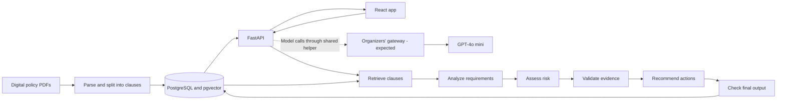

# Clause — Capstone Implementation Plan

> Revised 26 September 2026. Goal: a focused student project that works end to end and is straightforward to explain to reviewers.
> This revision replaces the earlier enterprise-sized roadmap. It changes the planned scope; it does not claim that the code has already been simplified or completed.
> Where older task checklists, architecture decisions or design briefs require more work, this plan governs the submission scope. Existing feature IDs are retained for reference.
> Dataset decision, confirmed by the user on 26 September 2026: use the fictional **Kestrel Mutual** policy corpus for development, evaluation and the submission demonstration. It remains the project dataset unless the user explicitly requests a change.
> Model update, 30 September 2026: the runtime model is now **Claude Sonnet 5.5 through the Anthropic API** on the owner's own key (`LLM_PROVIDER=anthropic`, `LLM_EFFORT=low`); the latest development results used it. Claude Haiku 4.5 is the cheaper option for test runs, and the GPT-4o mini gateway client below stays supported. Mentions of GPT-4o mini as the runtime model further down describe the plan as it stood on 26–29 September.
> Model update, 29 September 2026 (later): the organizers' gateway details and lab key arrived, and the project runs on **GPT-4o mini through their gateway** as originally planned (§4.4). The Claude Haiku 4.5 client added earlier that day, while the key was missing, stays available as `LLM_PROVIDER=anthropic`.
> Model/access update, 26 September 2026: target **GPT-4o mini** using an API key supplied later by the project organizers, with access expected through their gateway URL. Gateway details are pending. The Anthropic client has been replaced by one OpenAI-compatible gateway client (§4.4), tested against a local stub server only.

## 1. Project goal and current state

Clause helps a user check a business activity against a small collection of policy documents. The user describes the activity, the app finds relevant clauses, and five specialist stages produce an assessment with risks, missing information and suggested actions. The user can open the source behind each finding.

The presentation explanation should be:

> “I built a policy checking assistant. It searches the documents first, compares the relevant requirements with the user's scenario, checks the evidence, and explains what is missing or needs to change.”

The technical contribution is document retrieval, a clear five-role workflow, evidence handling and evaluation. Keep good validation, readable code and honest limitations. Every component should solve a problem we can demonstrate and explain.

### Current repository state

Updated 29 September 2026, after the organizers' gateway was connected. "Verified" means automated tests, a browser run or a real-model run; the development set has run on GPT-4o mini, and the held-out set has not run.

| Area | What exists | What remains |
|---|---|---|
| Frontend | Live mode connects Cases, Policies and Ask a question to the API: real progress, clarification, results, evidence drawer, trace, JSON export. Prototype screens are labelled in live mode. Verified in a browser with a scripted model. Completed cases also have a full printable report, checked in Chromium with fixture data. | Observe real model output |
| Corpus | 11 fictional policies, 14 versions and 111 clauses | Review labels and choose a small subset for the walkthrough |
| Backend | Five-role workflow (`services/api/app/workflow/`), case/run/resume/cancel/SSE endpoints, cited lookup answers, startup handling of interrupted runs. Model client runs GPT-4o mini through the organizers' gateway (`check-model` OK 29 September; replies over the gateway's 500-token cap are continued). A Claude client is kept as an alternative. 209 backend tests pass, including Postgres integration tests. | One real worked scenario through the UI, saved for the demo |
| Persistence | Cases, messages, scenario revisions, facts, runs with the final assessment JSON, progress events and handoff records | Nothing required; normalized finding tables stay unused |
| Evaluation | `python -m app.cli evaluate` in a separate database. Dev labels reviewed against clause text (4 corrected); retrieval on 13 dev scenarios: hybrid Recall@10 0.839, keyword-only 0.704, evidence-bundle recall 0.856. 20 held-out scenarios authored and checked against the corpus by a test, not yet run. The report also gives accuracy per confidence band (added 29 September). Dev assessments on GPT-4o mini (29 September): 5–7/13 correct with the v1 prompts; after tuning on dev (analysis-v2, validation-v2) 10, 10 and 9 of 13 over three runs, 0 false compliant, all citations valid; tuning log and failures in `docs/evaluation/analysis.md`. | Owner review and freeze of the held-out labels, then the single held-out run |
| Operations | Local PostgreSQL 16 + pgvector installed with the Python dependencies and started by `python -m app.cli db-start` (Docker removed 2026-09-29; CI uses the same command). CI checks. README with model setup, architecture, limitations and troubleshooting. Fresh setup verified from a clean database without a model (about 1.5 minutes of commands). Architecture diagram exported to PDF and JPEG; decisions page and presentation runbook written. | Repeat the fresh setup with a key; saved real result, recording and timed rehearsal |

Keep the working foundations. Do not spend the remaining schedule replacing the database, redesigning the UI or deleting unused schema merely to make the repository smaller.

Readiness update, 26 September 2026: [ten bounded tasks](docs/tasks/SESSION_2026-09-26.md) completed under F03/F04/F15. PDF ingestion now enforces its configured byte limit; clarification answers and operational settings are bounded. Policy viewing gained original-PDF page links, keyboard section focus, comparison retry errors and stale-citation notices. New database-backed checks cover ingestion limits, missing sources, draft protection and cross-organization case/run/SSE access. Verification: 133 backend tests and 9 frontend tests passed; frontend production build passed; the four policy-viewer fixes were checked in Chromium with HTTP mode and mocked responses. These checks do not establish live-model quality or public-deployment readiness. Held-out label review and the model-dependent delivery sequence remain pending.

Second readiness update, 26 September 2026: [twenty fixes](docs/tasks/SESSION_2026-09-26_B.md) completed for model-call budgets, gateway configuration, evaluation reporting and evidence/input error handling. Evaluation now rejects unreviewed held-out selections, excludes disputed labels, counts the evaluated subset correctly and preserves uniquely named raw results with input hashes. It does not perform or certify owner review/freeze. Verification: 164 backend tests and 18 frontend tests passed; backend lint/format/types and frontend build passed. No real-model results or new held-out measurements were produced.

Readiness update, 27 September 2026: [ten input/progress fixes](docs/tasks/SESSION_2026-09-27.md) completed. API inputs now validate trimmed text; case creation validates length/date and prevents duplicate submissions; streamed progress rejects malformed or wrong-run events, deduplicates sequence numbers, records only actual stage completions and resets on clarification restart. Verification: 178 backend tests, 26 frontend tests, lint/format/types, OpenAPI freshness and frontend build passed. Live-model evaluation and owner label review remain pending.

Update, 29 September 2026 (user request): every verdict now carries a confidence score instead of relying only on the whole-app evaluation. Each finding, overall result and lookup answer gets a 0-100 evidence score computed in code from recorded checks (validation, exact quote, stated facts, search rank), with a band and a visible breakdown; it is not a probability. The Evaluation page stays and now describes the real measurements; `evaluate` adds accuracy per confidence band. Verification: 187 backend and 27 frontend tests, lint/types/OpenAPI/build, and a Chrome walkthrough with the scripted model. Real-model band accuracy is in `docs/evaluation/results-dev.md` (29 September).

Second update, 27 September 2026: the optional avatar (F23) is done. In live mode, with the tests' scripted model, it was checked under reduced motion, hidden and without WebGL; the narrow-layout check for F12 passed at 390 px with no horizontal scroll. The backend has 178 passing tests and the frontend 26. A private review sheet lists each held-out label beside its clause text, so the owner can mark each one correct or disputed; the decisions are then applied to `data/evaluation/test/scenarios.json`. Nothing model-dependent changed: the key, the owner review and the real runs are still pending.

## 2. Assignment requirements to preserve

The requirements below were checked against all four pages of `Project_4_-_AI_Powered_POLICY_COMPLIANCE_INTELLIGENCE.pdf` on 26 September 2026. Page 3 labels the dataset as a policy/compliance corpus but links to biomedical literature sources. This mismatch remains documented as background. The user has selected Kestrel Mutual as the project dataset; this is a project decision, not a claim of assessor endorsement.

| Requirement recorded in the previous plan | Submission implementation | Demonstration evidence |
|---|---|---|
| Documents and searchable knowledge base (20%) | Digital PDFs, clauses, metadata and source references | Load a policy and retrieve a clause |
| Natural-language search and grounded responses (25%) | Existing hybrid search plus a cited lookup answer | Ask a question and open its source |
| Five specialist agents and communication (25%) | Retrieval, analysis, risk, validation and recommendation functions with structured handoffs | Inspect real stage outputs |
| UI and representative evaluation (20%) | Scenario, findings, risks, actions, citations and a measured report | Complete walkthrough and reported results |
| Architecture, decisions, code, README and presentation (10%) | Runnable API, diagram exported as JPEG or PDF, setup instructions and 10-minute presentation | Fresh setup and rehearsed demo |

Two interpretations remain to be confirmed with the assessor:

- **A2A:** default to internal structured communication between the five roles. Do not claim standardized Agent2Agent protocol compatibility. If the formal protocol is compulsory, F28 becomes required and optional polish gives way.
- **Microservice:** default to an independently runnable FastAPI backend with a frontend and database. Five roles do not automatically imply five servers. Revisit if separate deployments are explicitly required.

Use the fictional Kestrel Mutual policies as the confirmed corpus, as recorded in the [corpus decision](docs/data/corpus-decision.md). Keep synthetic-data labels and provenance; do not describe these as real company policies or the dataset supplied by the brief. Dataset clarification is not a pending implementation task or blocker. Do not replace or supplement Kestrel with PubMed, another organization or real policies unless the user explicitly requests that change.

## 3. Submission scope

### Required

- Browse policies and clauses; open the original PDF at the cited page.
- Search with natural-language questions and return a short cited answer.
- Submit a scenario and execute all five assessment roles.
- Show the overall result, findings, missing facts, risks and recommendations.
- Answer up to three clarification questions and rerun the assessment.
- Save completed cases and their evidence so they can be reopened.
- Show a short record of actual stages and handoffs.
- Evaluate the system and prepare the required submission artifacts.

### Small extras, after the required path works

- Connect the existing avatar to real states: idle, working, waiting, complete and failed.
- Reuse JSON export; add browser print styling if time permits.
- Demonstrate a changed scenario by editing facts and running again. A branch tree and comparison engine are unnecessary.

### Deferred

Durable worker queues, checkpoint recovery, a general rule interpreter, automatic policy-change impact, human review queues, execution replay, benchmark dashboards, voice, graph visualization, OCR/DOCX, training mode, multi-organization onboarding and cloud-scale infrastructure.

Existing fixture pages may remain in the repository. Hide them from live submission navigation or visibly label them as prototypes. Their presence is not a promise to finish their backends.

## 4. Architecture and choices

### 4.1 Keep the existing stack

| Component | Decision | Plain-language reason |
|---|---|---|
| UI | React, TypeScript, Vite and existing styling | The screens already display structured results |
| API | FastAPI and Pydantic | Python handles document/model work; schemas check data |
| Database | PostgreSQL with pgvector | One database stores records and supports existing search |
| Persistence | SQLAlchemy and Alembic | Reuse current tables and schema setup |
| PDF parsing | Existing pypdf path | Enough for the digital demo PDFs |
| Retrieval | Existing keyword and embedding search | Match policy terms and differently worded questions |
| Workflow | Ordinary Python functions in a fixed sequence | Easy to follow, debug and explain |
| Runtime model | GPT-4o mini using the organizers' forthcoming API key and expected gateway URL; exact endpoint/authentication details pending | Separate role prompts use the same model; one helper handles requests, schema checks and limits |
| Progress | Existing HTTP/SSE client contract | Reuse the frontend and show real stage completion |
| Setup | PostgreSQL from a Python package (`db-start`), uv for the API, Vite for web; no Docker | Reproduce the demonstration on one machine with only uv and Node.js installed |

LangGraph is in the earlier design but is not an installed backend dependency. Do not add it for this fixed workflow. Retain the current embedding implementation instead of starting a model-selection project.

### 4.2 Data flow

All workflow stages live in the same backend. They represent responsibilities, not separately deployed services. The gateway and model are external; the browser talks only to FastAPI. The final check is application validation, not a sixth specialist agent.

### 4.3 Implementation shape

Add a small `app/workflow/` folder in `services/api/`, with an orchestrator and one named module per role. Put provider calls and output parsing in one helper. Avoid plugin registries, generic base-agent classes and multiple repository/service abstraction layers.

Use an in-process background task so the API can return a run ID and serve progress. Run one API process for the local demo. Persist state, completed stage records and final results using existing tables. No separate worker or jobs framework is required.

The tradeoff: restarting the API interrupts an active assessment. On startup, mark abandoned running/queued runs failed and let the user start a new run. Completed results remain saved. Waiting-for-user cases keep their questions and can restart assessment after an answer. Do not promise recovery from the exact interrupted stage.

### 4.4 Supplied model access and gateway integration

The organizers will provide the API key later. Plan for GPT-4o mini through their gateway, while treating the gateway route as an expectation until connection details arrive. Do not require a personal OpenAI account, an Anthropic key or a separately purchased model subscription for the submission.

Keep these values configurable on the backend:

| Setting | Planned value/meaning |
|---|---|
| `LLM_MODEL` | `gpt-4o-mini`, or the organizers' exact deployment alias for that model |
| `LLM_API_KEY` | Supplied key, stored in the local backend environment; never committed or placed in `VITE_*` variables |
| `LLM_BASE_URL` | Supplied gateway base URL, with no guessed hostname or path; requests go to `<base>/chat/completions` |
| `LLM_PROVIDER` | `openai_compatible` selects the gateway client; `none` (default) disables model-backed features |
| `LLM_API_KEY_HEADER` | Optional; unset sends `Authorization: Bearer <key>`, a name such as `api-key` sends the key in that header instead |
| `LLM_JSON_MODE` | `json_schema` (default, strict schema), `json_object` for a gateway without schema support, or `json` (the organizers' plain-string form) |
| `LLM_TEMPERATURE` | Optional; unset leaves the model default (0 for the organizers' gateway) |
| `LLM_MAX_OUTPUT_TOKENS` | Reply cap per request, default 4096 |

Implemented 26 September 2026, verified only against a local stub server. `services/api/app/workflow/llm.py` holds one `GatewayModel` (official OpenAI SDK with the supplied base URL) behind the existing `ModelClient` interface; `app/config.py`, `.env.example` and README were updated together and workflow inputs/outputs are unchanged. The Anthropic client and dependency were removed. There is no provider-routing framework or automatic fallback to another service. The last two optional settings exist because the gateway's authentication and JSON support are not yet known; they avoid a code change when the details arrive.

Connected 29 September 2026. The organizers' instructions give the gateway `https://keygateway1.arshnivlabs.com` (OpenAI-style `/v1/chat/completions`, `Authorization: Bearer <lab key>`) and say not to send a model name. Its published request schema accepts only `messages`, `temperature`, `top_p`, `max_tokens` (at most 500) and `response_format` as the string `"json"` or `"text"`. The working configuration is therefore `LLM_BASE_URL=https://keygateway1.arshnivlabs.com/v1`, `LLM_MODEL` unset, `LLM_JSON_MODE=json`, `LLM_MAX_OUTPUT_TOKENS=500` and `LLM_TEMPERATURE=0` (the gateway defaults to 1.0). A reply cut off at the cap is continued (up to three follow-up requests, joined before validation); see `docs/architecture/decisions.md`. The gateway reports `gpt-4o-mini-2024-07-18` as the served model.

Use the gateway's documented request format. If it is OpenAI-compatible, use that interface with its supplied base URL; do not assume a gateway accepts the public OpenAI endpoint paths, Bearer authentication or every model option. Confirm the exact URL/path, authentication headers, model alias, JSON-output support and request limits from the organizers' instructions or sample request.

OpenAI lists `gpt-4o-mini` and structured-output support in its [model documentation](https://developers.openai.com/api/docs/models/gpt-4o-mini). Gateway support must be checked separately. Prefer schema-constrained JSON when exposed; otherwise request JSON and enforce the same Pydantic validation and bounded repair. Do not carry Anthropic-specific options into gateway requests.

Until credentials arrive, continue with the scripted model tests, ingestion, local embeddings and retrieval evaluation. Mark model-backed results as unverified; do not substitute fixtures for live assessment metrics. Retrieval embeddings remain local and do not need this key.

Once access arrives, test one small request (`python -m app.cli check-model`), one cited lookup and one full Kestrel assessment including clarification. Check invalid-output, authentication, timeout and rate-limit handling using controlled tests, then run real assessment evaluation. Record the actual model/deployment and usage returned by the gateway; do not assume public API quotas or prices apply.

## 5. Data and API contracts

### 5.1 Core records

| Record group | Purpose |
|---|---|
| Policy, version, clause and source page/span | Know which text a finding refers to and where to open it |
| Chunk and embedding | Search text without losing the parent clause |
| Policy snapshot | Save which versions were used |
| Case, scenario revision, message and fact | Save the question, answers and user-provided facts |
| Assessment run | Save state, configuration, errors and final structured assessment |
| Stage event and agent message | Show what ran and what each role passed onward |

Use the existing `AssessmentRun.assessment` JSON field for the final document. Do not duplicate every nested result into all the normalized finding/risk/recommendation tables unless an implemented query needs that storage. Keep one authoritative final result.

Existing job, review and audit tables can remain unused. Their presence does not make worker leases, reviewer workflows or an audit subsystem release requirements.

### 5.2 Result semantics

Retain current contract values to avoid unnecessary frontend changes:

- Requirement: `met`, `violated`, `unknown`, `not_applicable`, `conflict`.
- Assessment: `non_compliant`, `conflicting_policy`, `insufficient_information`, `compliant_within_scope`, `out_of_scope`.
- Run: `queued`, `running`, `waiting_for_user`, `completed`, `failed`, `canceled`.

Derive the overall result in ordinary Python:

1. A supported violation of an applicable requirement gives `non_compliant`.
2. Otherwise, an unresolved applicable policy conflict gives `conflicting_policy`.
3. Otherwise, missing material facts or insufficient support gives `insufficient_information`.
4. If applicable requirements were identified and all are supported and met, use `compliant_within_scope`.
5. If the corpus establishes no applicable requirement, use `out_of_scope`.

Keep unknowns and conflicts visible even when a violation determines the result. A technical failure makes the run fail; it is not an out-of-scope or compliant result. Empty/irrelevant search needs an explicit no-applicable-evidence path and must never fall through to compliance.

“Approval was not mentioned” means unknown. “I have not obtained approval” establishes its absence. Inferred facts must not silently become confirmed user statements. Do not show a probability-of-compliance percentage.

### 5.3 Assessment output

Reuse `services/api/app/domain/contracts.py`, the TypeScript types and `packages/contracts/fixtures/assessment.vendor-sharing.json`. Fixtures illustrate the format; they are not live results.

A result includes scope, snapshot, summary, findings, citations, risks, recommendations and limitations. Each decisive finding references evidence. The backend builds citation metadata and URLs from stored records; the model selects permitted clause IDs. Update backend, frontend and fixtures together if a contract needs to change.

### 5.4 Minimum API surface

| Routes under `/api/v1` | Responsibility |
|---|---|
| Existing policy/version/clause/page/source GET routes | Reuse the library and evidence viewer |
| `POST /search` | Reuse evidence search |
| `POST /lookup` | Replace the placeholder with a grounded answer |
| `POST /cases`, `GET /cases`, `GET /cases/{id}` | Create and reopen cases |
| `POST /cases/{id}/messages` | Save follow-up text |
| `POST /cases/{id}/runs` | Create a run and start the task |
| `GET /runs/{id}`, `GET /runs/{id}/events` | Return saved state/result and real progress |
| `POST /runs/{id}/resume` | Save clarification answers and restart the sequence |
| `POST /runs/{id}/cancel` | Stop subsequent stages and prevent publishing a canceled result |

“Resume” is the existing client action name: it starts processing again from saved facts, not a graph checkpoint. Preserve the original snapshot for clarification. Reuse the run ID so the current client subscription remains valid; keep event sequence numbers increasing. Changed facts after a completed result start a new run.

Enforce one active attempt per run with a database state check. Repeated starts with the same idempotency key return the existing run; duplicate resume requests must not launch another task. Use a small transaction, not a general job-leasing system.

No new API is required for reviewer decisions, branches, policy impact or evaluation dashboards. Use CLI ingestion for the curated PDFs; upload administration is deferred.

### 5.5 Progress and handoffs

Reuse event names and message contracts. Save the stage, brief input/output summary and time for each real handoff. “Retrieved 8 clauses” should appear after retrieval actually finishes.

Serve saved events after the last received sequence on reconnect and fetch current case/result state. This is a small progress log, not an event-sourced application or replay engine. Never stream private reasoning, secrets or fabricated stage activity.

## 6. Ingestion, retrieval and evidence

### 6.1 Ingestion

Keep the existing path: digital PDF → extracted page text → numbered clauses → chunks → embeddings and database records. Preserve title, version, section, page and source text. Use the manifest and seed command.

Support the known digital PDFs. Return a clear error for scans or failed extraction; add OCR only if the required corpus needs it. Automatic requirement-to-code generation and policy publishing workflows are deferred.

### 6.2 Retrieval

Keep full-text and vector search with identical date/version/scope filters. Existing code combines ranks using reciprocal rank fusion and removes duplicate clauses. Explain this as: “I combine the order of keyword matches and meaning-based matches.” Its score is not a confidence percentage.

The evidence bundle starts from the top 10 search hits and adds cited, exception and definition clauses, up to 14 clauses. Ten was chosen on development scenarios only: it raised bundle recall from 0.822 (eight hits) to 0.856. Pass a small relevant clause bundle, including definitions and exceptions needed to interpret a requirement. Use simple clause lookup for explicit cross-references. Do not build a dependency graph or add a reranker without a demonstrated retrieval failure.

A saved run must keep its selected snapshot after clarification. Current standalone search selects the latest snapshot; add an optional snapshot argument for assessment retrieval rather than a new version-selection service.

### 6.3 Citation checks

- Check selected clauses belong to the run's retrieved evidence and snapshot.
- Check quoted text occurs in the clause and the source reference resolves.
- Separately check whether that clause supports the conclusion.
- Show extracted text and the correct PDF page; graphical PDF highlights are optional.
- Exclude unsupported claims from decisive findings and expose the limitation.

Matching a quote proves the text exists. It does not prove the interpretation is correct.

## 7. Five-role workflow

### 7.1 Responsibilities

| Role | Implementation | Output |
|---|---|---|
| Retrieval | Existing search function | Relevant clauses and IDs |
| Compliance analysis | One structured model call comparing scenario and clauses | Findings, missing facts and up to three questions |
| Risk assessment | Small documented Python rubric | Severity and reason linked to each gap |
| Interpretation/validation | Python citation checks plus one model pass on support and exceptions | Supported, unsupported or conflicting findings |
| Recommendation | One structured model call on validated findings | Actions linked to findings and permitted citations |

Each role has its own function, schema and recorded handoff. Retrieval and risk do useful deterministic work without separate LLM calls. Describe five specialist stages; do not imply five autonomous models negotiating. Validation may downgrade a violated or met claim to unknown when it rested on an unstated fact; it cannot create a new verdict.

### 7.2 Orchestration and risk

Run retrieval → analysis → risk → validation → recommendation → final checks. Pass structured outputs directly between functions. Final checks verify schemas, references and recommendation support before saving. A short final validation call may check newly generated action wording; this remains part of the validation responsibility.

Start the risk rubric with three documented labels: high for a supported mandatory breach involving customer data/access, medium for other supported mandatory breaches, and low for non-mandatory improvements. Unknown impacts remain unresolved; do not invent severity or likelihood. Check this demo rubric against development cases. If validation changes a finding, recompute its risk before saving.

No general rule engine is planned. If a particular threshold repeatedly fails evaluation, add a named comparison with a focused test and explain which clause it handles.

### 7.3 Clarification

When material facts are missing, save the questions and enter `waiting_for_user`. Ask at most three questions in one round, with an “I don't know” option. On submission, rerun with the saved scenario and answers, skip another clarification pause and retain unanswered facts as unknown. Complete all five roles and return a qualified result.

There is no branching tree, checkpoint manager or automatic partial recomputation.

### 7.4 Failures and limits

Use GPT-4o mini through the supplied access route, bounded input, schema validation and clear timeout errors. A normal attempt should need three or four model calls; retrieval and risk are local code. Retain the current configurable eight-call and 120-second limits as initial guards, not performance claims; adjust if the supplied gateway's documented limits require it. Allow at most one structured-response repair per stage, count retries in the budget and stop at the global limit. Configure client-level retries so they do not multiply the workflow's retry budget.

Clarification starts a new bounded attempt after user input; waiting time is excluded. Check cancellation between calls and before publishing. An already-sent provider request may still finish or incur usage. Record failures and allow explicit retries rather than autonomous retry loops.

## 8. Existing feature IDs and revised scope

The old `docs/tasks/Fxx.md` checklists describe the larger roadmap. Their completion counts are historical, not percentages for this revision. Update a checklist to this scope when taking up its task; do not mark deferred requirements completed.

| ID | Current scope |
|---|---|
| F00 | Keep repository, contracts and current checks |
| F01 | Confirmed Kestrel Mutual corpus and reviewed scenario labels; dataset changes require an explicit user request |
| F02 | Core schema and saved assessment JSON; no expansion for future features |
| F03 | Digital-PDF ingestion and understandable failures |
| F04 | Live policy/source viewing |
| F05 | Existing hybrid retrieval and its evaluation |
| F06 | Short cited lookup answer |
| F07 | Python orchestration and structured handoffs; no persistent graph or worker leases |
| F08 | Analysis and one clarification round; no rule interpreter |
| F09 | Small explained risk rubric |
| F10 | Citation and support validation; no retrieval-repair loop required |
| F11 | Cited, actionable recommendations |
| F12–F13 | Live workspace, results and evidence |
| F14 | Evaluation script and measured report |
| F15 | Local demo boundary, server-side secrets, validation and existing access filters; public login deferred |
| F16 | Save/reopen results and reuse JSON export; full audit history deferred |
| F17 | Local startup and interrupted-run handling; cloud/recovery platform deferred |
| F18 | Setup, diagram, decisions, presentation and rehearsal |
| F19–F21 | Defer comparison engine, policy impact and reviewer workflow |
| F22 | Short stage log; defer replay |
| F23 | Optional existing-avatar connection to real states |
| F24–F27 | Defer evaluation UI, voice, dependency graph and expanded ingestion |
| F28 | Formal A2A only if the assessor requires it |
| F29 | Defer training sandbox |

Completion means real input produces the expected saved result through the API/UI, with relevant checks and an explanation. A fixture screenshot or a table definition is insufficient evidence.

## 9. Implementation order and checks

1. **Verify foundations:** start the stack, seed the corpus, search a clause and open its source.
2. **Build one assessment:** implement the five functions and run a real scenario through the API. Check unknown facts and citations.
3. **Save and connect:** persist cases/results, connect the workspace and real progress. Refresh and reopen a completed assessment.
4. **Finish behavior:** add clarification, failure/cancel states and lookup answers. Unsupported conclusions must not decide outcomes.
5. **Evaluate and fix:** tune on development cases, freeze the held-out split and record actual results and failures.
6. **Package and rehearse:** verify clean setup, export the diagram, save an example result and practice the presentation.

Use existing checks and add focused tests for verdict aggregation, missing-versus-absent facts, invalid citations, clarification and duplicate starts. An integrated test should cover scenario → result → source. Avoid a new test framework for unused features.

## 10. Main demonstration scenario

Use Customer Data Sharing v1 and Vendor Due Diligence v1 with a scenario date of **26 September 2026**.

> “We plan to send customer records to an external analytics vendor. We have not obtained written data-owner approval. I do not know whether the vendor review is complete.”

Expected behavior:

- Retrieve Data Sharing §4.2 and Vendor Due Diligence §3.1, with relevant definitions and exceptions.
- Mark data-owner approval violated because the scenario explicitly establishes its absence.
- Mark vendor approval unknown and ask for its status; missing information does not establish an unapproved vendor.
- Return `non_compliant` for the stated plan while still displaying other unknowns.
- Recommend obtaining and recording approval before transfer, and confirming vendor status, with citations.
- Open a source page to show where a requirement came from.

Then change the facts and rerun. Written approval can make that finding met, but remaining requirements still need checking. Do not promise whole-case compliance from one changed fact. Also prepare an uncovered question and an “I don't know” answer.

## 11. Avatar

Keep the existing design. After the required flow works, connect the controller to actual run states. It can idle, react during processing and indicate completion or user input.

No custom rigging, speech, emotion inference or extra model calls. The app must work with it disabled, with reduced motion or when WebGL fails. Explain it as a visual progress companion; it does not make decisions.

## 12. UI to finish

Use three main areas: **Policies**, **Ask a question**, and **Cases**. A case contains the scenario, clarification, result, findings, risks, recommendations and evidence drawer. Reuse existing components and visual style.

Use plain progress labels such as “Finding policies” and “Checking evidence.” Make the technical stage log expandable. Keep internal configuration out of the normal user flow.

Cover loading, completed, waiting, no applicable evidence, failed and canceled states. Keep keyboard navigation, visible focus and status text alongside color. Preserve fictional-corpus and fixture labels. Prioritize a readable desktop presentation and usable narrow layout over more pages.

Admin, review, impact and benchmark fixture screens are outside the live submission path. Hide or label unfinished actions.

## 13. Evaluation

### 13.1 Dataset

Keep the 13 development scenarios and target **20 held-out scenarios**, matching the evaluation README. Review labels against policy text. Keep related scenario families in one split. Freeze test labels before the final run; never tune on them or put answer keys into the index or prompts.

Cover lookup, multiple policies, violations, missing facts, exceptions, conflicts/date boundaries and out-of-scope questions. Report the actual completed sample count. An 80-case benchmark and dashboard are deferred.

### 13.2 Measurements

| Measurement | Definition/reporting |
|---|---|
| Recall@10 | Expected relevant clauses in the top ten divided by expected clauses, averaged over answerable cases; no-evidence cases are N/A |
| Citation validity | Resolvable references with matching quote/version divided by emitted citations |
| Evidence support | Manually supported decisive claims divided by reviewed decisive claims; state the review sample |
| Final-status accuracy | Cases matching an acceptable labelled result divided by evaluated cases |
| False-compliant results | Count of non-compliant labelled cases predicted compliant, with denominator |
| Runtime | Median completed-run time, failure count and model/configuration |

Include two or three real failures. Zero observed false-compliant results on a small set is not proof of correctness. Distinguish valid references from correct interpretations.

Use one script reading evaluation JSON and calling the same workflow. Save raw results and a Markdown report at `docs/evaluation/results-<split>.md`, with corpus version, model, prompt/configuration and date. Implemented as `python -m app.cli evaluate`; the hand-written failure analysis is in `docs/evaluation/analysis.md`. Skip model tournaments, nDCG and multiple ablations. A keyword-versus-hybrid comparison is an optional experiment after required evaluation.

### 13.3 Submission checks

The demo must use real outputs, source links must resolve, and unknown facts must remain visible. Test a provider failure and interrupted run. Investigate false-compliant outcomes, fix and rerun affected checks or document the limitation. Never present invented numbers or targets as measured results.

## 14. Performance and complexity boundaries

Target a local demonstration with one active assessment at a time. Measure latency before making claims. Prevent duplicate submission in the UI and backend.

Keep current search, one model configuration, small evidence inputs and explicit limits. Log stage durations and provider usage when available. Do not add caching layers, approximate indexes, load-balancing, distributed locks or cost dashboards for an unmeasured scaling problem.

Before adding a dependency or abstraction, identify the failing behavior it fixes, why a normal function is insufficient and how its role will be explained. Without a concrete reason, leave it out.

## 15. Local setup and safeguards

Reuse README commands for database startup, migration, seeding, API startup and Vite. Verify them after integration rather than writing a second deployment system.

Use fictional data and the seeded demo identity locally. Session authentication is unfinished, so this is not a public multiuser service. Public hosting requires implemented and tested authentication/authorization; do not bypass production checks to deploy a demo.

Keep provider keys server-side, ingestion size/page limits, generated storage paths, current access filters and clear errors. Treat policy text as evidence, not tool instructions. No generated-code execution is needed. Avoid logging secrets or complete provider payloads.

The release needs repeatable startup and saved results, without automatic recovery, cloud storage or a separate worker deployment.

## 16. Remaining delivery sequence

The earlier plan recorded a five-day window beginning 25 September. This revision uses the existing foundations within that window; it does not restart a fresh five-day project.

| Session | Focus | Finish condition | Status |
|---|---|---|---|
| 1 | Five-role backend, gateway integration and one real scenario | Structured assessment with supported findings | Workflow tested with a scripted model; gateway connected 29 September and the 13 dev scenarios run on GPT-4o mini; the worked scenario through the UI remains |
| 2 | Persistence, live workspace, progress, clarification and lookup | Complete UI flow and saved-result reopening | Done; verified in a browser |
| 3 | Evaluation and corrections | Raw results, measured report and limitations | Script done; dev labels reviewed and retrieval re-measured; 20 held-out scenarios authored; owner review, freeze and model runs remain |
| 4 | Clean setup, diagram, documentation and rehearsal | Executable submission and timed presentation | Fresh setup verified without a model; diagram exported; decisions, limitations and presentation runbook written; real-model setup check, recording and rehearsal remain |

These are priorities, not a guarantee regardless of defects. If the workflow is late, stop optional polish and finish it. State any incomplete requirement plainly. Do not start new features or swap libraries in the final session.

## 17. Presentation and submission

### 17.1 Ten-minute walkthrough

| Time | Content |
|---|---|
| 0:00–1:00 | Problem, user and fictional corpus |
| 1:00–2:00 | Policy, clauses and original source |
| 2:00–4:00 | Live scenario, clarification and assessment |
| 4:00–5:00 | Citation; violation versus unknown |
| 5:00–6:00 | Architecture and five functions with a real handoff |
| 6:00–7:00 | Evaluation and one failure |
| 7:00–8:00 | Choices, limitations and setup |
| 8:00–10:00 | Reviewer questions |

Keep a saved result and a labelled recording available if the provider is slow. They supplement the executable app. The avatar is a small visual detail.

### 17.2 Explanations to practice

| Reviewer question | Explanation to understand and support with code |
|---|---|
| Why five agents? | The brief asks for five roles. Each function has one responsibility and passes structured output onward. They share a backend and model configuration. |
| How do you access the model? | FastAPI sends requests through the organizers' gateway to GPT-4o mini with the supplied lab key, which stays on the server. One shared client serves the model-backed roles. The gateway allows no JSON schema and 500-token replies, so the schema goes in the prompt, every reply is validated, and cut-off replies are continued. |
| What is retrieval-augmented generation? | Search policy text and give relevant passages to the model before it answers. |
| Why keyword and vector search? | Keywords find terms; vectors find related wording. The code combines rankings; evaluation supports quality claims. |
| How do citations work? | The model selects clause IDs; the server resolves text, version and page. Validation checks the claimed interpretation too. |
| What if facts are missing? | Ask a bounded clarification, then keep unanswered requirements unknown. |
| Why one database/API? | The demo fits in one application and setup stays manageable. |
| Why no workflow framework? | A fixed sequence and one clarification round fit ordinary Python control flow. |
| Does validation guarantee correctness? | No. Reference checks catch invalid evidence, but interpretation can fail; evaluation records those failures. |
| What happens after restart? | Completed results remain saved. Interrupted assessments need a new run. |
| Did you train the model? | No. The contribution is corpus processing, retrieval, workflow, validation, evaluation and the app around existing models. |
| What is yours or assisted? | Describe implemented components, libraries and assistance accurately; be able to explain the core code. |

These are study prompts, not claims to repeat without understanding. Trace one case through retrieval, analysis, validation, persistence and rendering. Explain a failing case too.

### 17.3 Submission checklist

- [ ] Executable frontend/backend with live assessments.
- [ ] README with verified setup and sample scenario (verified without a model on 26 September; repeat with the key).
- [x] Architecture source plus JPEG or PDF export (`docs/architecture/`).
- [x] Decisions/tradeoffs matching the implementation (`docs/architecture/decisions.md`).
- [x] Corpus description and synthetic-data label.
- [ ] Reviewed evaluation inputs, raw results and report.
- [ ] Saved real assessment with working citations.
- [ ] Presentation material and ten-minute rehearsal (script in `docs/presentation/README.md`; no slide deck, by the owner's choice; rehearsal pending).
- [x] Limitations and third-party/model/asset acknowledgements.

## 18. Remaining decisions

The corpus remains Kestrel Mutual unless the user explicitly requests a change. The model is GPT-4o mini through the organizers' gateway, connected on 29 September 2026 with the settings in §4.4 (no model name, `LLM_JSON_MODE=json`, 500 output tokens with continuation). A provider/model selection exercise is no longer pending. Formal A2A and separate deployments stay unconfirmed with the assessor; the defaults in §2 apply until then.

Do not reopen the frontend, visual style or database without a blocker. Kestrel's digital PDFs remain the ingestion scope; reconsider OCR only if the user later changes the document requirements.

## 19. Plan maintenance

This plan defines submission scope. `docs/tasks/` retains implementation evidence; update an affected checklist before working from it. Older architecture records and frontend plans explain historical choices but do not override this revision. Read old section-number references by subject where headings changed.

Update status only after verification. Keep planned, fixture and implemented behavior distinct. The code still contains broader scaffolding; assess simplification when touching an area, without a disruptive pre-presentation rewrite.

The finished project should be small enough that the student can explain every step from question to cited result, show how it was checked and describe what it cannot do.
