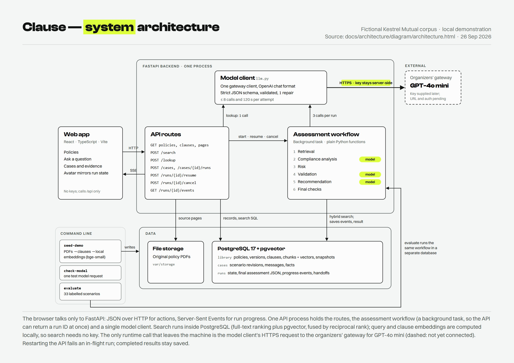

# Clause

Policy compliance intelligence: describe a business activity, get the applicable policy clauses, a structured assessment, the gaps and risks, and recommended actions, with every finding traceable to the exact clause, page and policy version behind it.

Capstone project. The demo corpus is a **fictional** organization's policies (Kestrel Mutual), not real policy, law or regulatory guidance. See [docs/data/corpus-decision.md](docs/data/corpus-decision.md).

## Status (26 September 2026)

| Area | State |
|---|---|
| Web app (`apps/web`) | Live mode (`VITE_API_MODE=http`) connects Cases, Policies and Ask a question to the API. The front door and the review, report, evaluation and settings screens are fixture prototypes; live mode labels them as such. |
| API (`services/api`) | Schema and migrations, PDF ingestion with source offsets, hybrid search, policy and source endpoints, cases, runs with progress events (SSE), clarification, cancel, and cited lookup answers. |
| Assessment workflow | Five stages in `app/workflow/`: retrieval, analysis, risk, validation, recommendation, then final checks. Tested end to end with a scripted model. The model client targets GPT-4o mini through the project organizers' gateway (OpenAI-compatible format, tested against a local stub); live runs wait for the organizers' key and gateway details. |
| Evaluation | `python -m app.cli evaluate`: retrieval measured on 13 reviewed development scenarios (hybrid Recall@10 0.839). 20 held-out scenarios are written and await review before their single final run. Assessment metrics need a model. |

Live per-feature state: [docs/tasks/](docs/tasks/README.md). Plan: [IMPLEMENTATION_PLAN.md](IMPLEMENTATION_PLAN.md). Design system: [DESIGN.md](DESIGN.md).

## Set up on a new machine

These steps take a fresh laptop to the running app. They were written on Windows 11 with PowerShell; where macOS or Linux differs, both commands are shown. Plan for about 15 minutes, most of it downloads.

### 1. Install the tools (once per machine)

| Tool | What it is for | Get it |
|---|---|---|
| Git | Clone the repository | <https://git-scm.com/downloads> |
| Docker Desktop | Runs PostgreSQL 17 with pgvector | <https://www.docker.com/products/docker-desktop/> (on Windows it sets up WSL 2 and may ask for a restart) |
| uv | Installs Python 3.12 and the API's dependencies; you do not need to install Python yourself | Windows: `powershell -ExecutionPolicy ByPass -c "irm https://astral.sh/uv/install.ps1 \| iex"`<br>macOS/Linux: `curl -LsSf https://astral.sh/uv/install.sh \| sh` |
| Node.js 22 | Runs the web app; includes corepack, which provides the pinned pnpm 10 | <https://nodejs.org/en/download> (choose v22) |
| Google Chrome | Only for the browser tests (Playwright uses the installed Chrome) | <https://www.google.com/chrome/> |

Open a **new** terminal so the tools are on your PATH, then check them:

```bash
git --version
docker --version
uv --version
node --version        # v22.x
corepack --version
```

On Windows, if PowerShell says "running scripts is disabled on this system" for `corepack` or `npm`, run `Set-ExecutionPolicy -Scope CurrentUser RemoteSigned` once and open a new terminal.

### 2. Get the code

```bash
git clone https://github.com/PaulAndrew7/prodapt-capstone.git
cd prodapt-capstone
```

### 3. Create your `.env`

```powershell
Copy-Item .env.example .env      # Windows PowerShell
```

```bash
cp .env.example .env             # macOS/Linux
```

The defaults work as they are. `.env` is git-ignored, so the model key never travels with the repository; to use a model, add the key yourself (see [Connect the language model](#connect-the-language-model)).

### 4. Start the database

Start Docker Desktop and wait until it reports that the engine is running. Then, from the repository root:

```bash
docker compose up -d db
docker compose ps                # after a few seconds the db service shows "healthy"
```

Postgres listens on host port **5433** so it does not clash with a local Postgres on 5432. The data lives in a Docker volume and survives restarts.

### 5. Set up and start the API (terminal 1)

```bash
cd services/api
uv sync                                  # downloads Python 3.12 if needed; creates services/api/.venv
uv run python -m app.cli migrate         # creates the schema; the API never migrates on startup
uv run python -m app.cli seed-demo       # ingests the demo policy PDFs; the first run downloads a ~70 MB embedding model
uv run uvicorn app.main:app --port 8000
```

Leave it running. <http://localhost:8000/health/ready> should return `"status":"ok"` with `database`, `migrations` and `storage` all `ok` (`llm_provider` stays `not configured` until you add a key). The interactive API docs are at <http://localhost:8000/docs>.

### 6. Install and start the web app (terminal 2)

From the repository root:

```bash
corepack pnpm install            # answer Y if corepack asks to download pnpm
```

Then start Vite in live mode, so the app talks to your API:

```powershell
$env:VITE_API_MODE="http"; corepack pnpm --dir apps/web dev      # Windows PowerShell
```

```bash
VITE_API_MODE=http corepack pnpm --dir apps/web dev              # macOS/Linux
```

Open <http://localhost:5173> for the front door and <http://localhost:5173/app> for the application. Vite proxies `/api` and `/health` to port 8000.

Without `VITE_API_MODE`, the web app runs on built-in fixture data and needs neither the API nor the database, which is handy for a quick look at the interface.

### 7. Every time after that

The install, migrate and seed steps are one-offs. To start working again:

1. Start Docker Desktop, then `docker compose up -d db` from the repository root.
2. Terminal 1: `cd services/api`, then `uv run uvicorn app.main:app --port 8000`.
3. Terminal 2: the live-mode Vite command from step 6.

After a `git pull`, run `uv sync`, `uv run python -m app.cli migrate` and `corepack pnpm install` again; each does nothing if nothing changed. `seed-demo` is also safe to repeat, since it skips policy versions that are already loaded.

To stop, press Ctrl+C in both terminals and run `docker compose stop`. To start over with an empty database, run `docker compose down -v` (this deletes the database volume), then repeat steps 4 and 5.

### Run the API in Docker instead

If you would rather not install uv, the API also runs in a container: `docker compose up --build -d`, then `docker compose run --rm api python -m app.cli migrate` and `docker compose run --rm api python -m app.cli seed-demo`. The web app still runs with step 6.

## Connect the language model

Configuration lives in environment variables read from `.env` at the repository root. Production refuses development defaults (database URL, session secret, demo auth).

Assessments and lookup answers need a language model: GPT-4o mini through the gateway the project organizers provide, with their key. The client speaks the OpenAI chat-completions format against whatever base URL you give it; it does not assume the public OpenAI endpoint. Set these in `.env`, then restart the API:

```bash
LLM_PROVIDER=openai_compatible
LLM_BASE_URL=...           # the gateway base URL from the organizers; requests go to <base>/chat/completions
LLM_MODEL=gpt-4o-mini      # or the gateway's exact alias for it
LLM_API_KEY=...            # read by the API only; never sent to the browser
# LLM_API_KEY_HEADER=api-key   # only if the gateway wants the key in a named header instead of Bearer
# LLM_JSON_MODE=json_object    # only if the gateway rejects JSON-schema response formats
# LLM_TEMPERATURE=0            # optional; unset uses the model default
```

Then confirm the connection with one small request before running an assessment:

```bash
cd services/api
uv run python -m app.cli check-model     # prints the served model, token counts and time, or the error
```

Without a model, policy browsing and evidence search still work. Starting an assessment or asking a question returns a clear `model_not_configured` error instead of a result.

## Sample usage

```bash
curl -s localhost:8000/health/ready
curl -s localhost:8000/api/v1/policies
curl -s localhost:8000/api/v1/policy-versions/ds_v1            # clauses of the Customer Data Sharing Policy v1
curl -s -X POST localhost:8000/api/v1/search -H 'content-type: application/json' \
  -d '{"question": "Can we send customer records to an analytics vendor without data owner approval?"}'
curl -sL "localhost:8000/api/v1/policy-versions/ds_v1/source?page=2" -o ds_v1.pdf   # the cited original
```

With a model configured:

```bash
# A cited answer to a policy question
curl -s -X POST localhost:8000/api/v1/lookup -H 'content-type: application/json'   -d '{"question": "Who must approve sharing customer data with a vendor?"}'

# An assessment: create a case, start a run, follow progress, read the result
CASE=$(curl -s -X POST localhost:8000/api/v1/cases -H 'content-type: application/json'   -d '{"text": "We plan to send customer records to an external analytics vendor. We have not obtained written data-owner approval. I do not know whether the vendor review is complete.", "business_area": "Marketing analytics", "as_of": "2026-09-26"}' | jq -r .id)
RUN=$(curl -s -X POST localhost:8000/api/v1/cases/$CASE/runs -H 'Idempotency-Key: demo-1' | jq -r .run_id)
curl -sN localhost:8000/api/v1/runs/$RUN/events          # progress; stays open while waiting for answers (Ctrl+C)
curl -s localhost:8000/api/v1/runs/$RUN | jq '.state, .pending_questions'
curl -s -X POST localhost:8000/api/v1/runs/$RUN/resume -H 'content-type: application/json'   -d '{"answers": {"q_1": null}}'                        # null means "I don't know"
curl -s localhost:8000/api/v1/runs/$RUN | jq '.assessment.status, .assessment.findings'
```

`uv run python -m app.cli search "who approves temporary production access"` prints ranked clauses with their lexical and dense ranks. OpenAPI docs: http://localhost:8000/docs.

## Evaluation

```bash
cd services/api
uv run python -m app.cli evaluate --split dev                   # retrieval, plus assessments if a model is set
uv run python -m app.cli evaluate --split dev --retrieval-only  # no model calls
```

The command creates and seeds a separate `<database>_eval` database, so evaluation cases never appear in the demo. It writes `docs/evaluation/results-<split>.md` (currently [results-dev.md](docs/evaluation/results-dev.md)) and a raw JSON file; the written failure analysis is in [docs/evaluation/analysis.md](docs/evaluation/analysis.md). Answer keys in `data/evaluation/` are never indexed or put into prompts.

## Checks

```bash
cd services/api
uv run ruff check app tests ../../scripts && uv run mypy app
uv run pytest                     # DB tests use a separate <db>_test database; skipped if Postgres is down
uv run python -m app.cli export-openapi --check

corepack pnpm --dir apps/web typecheck
corepack pnpm --dir apps/web test
corepack pnpm --dir apps/web exec playwright test
```

CI (`.github/workflows/ci.yml`) runs the same checks plus a clean migration, corpus reproducibility and a demo seed.

## Architecture



One FastAPI process serves the API and runs each assessment as a background task: retrieval, compliance analysis, risk, validation and recommendation, then final checks that decide the status with ordered rules. Search runs inside PostgreSQL with local embeddings; the only external runtime call is the model request to the organizers' gateway. The full diagram (system and workflow pages) is [docs/architecture/architecture.pdf](docs/architecture/architecture.pdf), and the decisions and tradeoffs are in [docs/architecture/decisions.md](docs/architecture/decisions.md).

## Limitations

- **No live model output yet.** The GPT-4o mini gateway client is tested against a local stub server only. Assessment accuracy, citation validity and run time are unmeasured until the organizers' key arrives.
- **Small, fictional evaluation.** 13 development and 20 held-out scenarios on an invented corpus; results describe this corpus, not general accuracy. No held-out case expects a policy conflict, because the corpus's only two-policy conflict is in the development split.
- **Valid citations are not correct interpretations.** Validation proves a quoted passage exists in a retrieved clause; whether it supports the conclusion relies on a model check and human review.
- **Retrieval misses some clauses.** Purpose-limitation rules are rarely in the top ten because scenarios describe what is sent, not why ([analysis](docs/evaluation/analysis.md)).
- **One process, one user.** A restart fails an in-flight run (completed results stay saved). Demo authentication maps every request to one seeded user; this is not a public multi-user service.
- **Digital PDFs only.** No OCR, DOCX or upload administration; the corpus is ingested from the command line.
- **Prototype screens.** Review, reports, evaluation lab and settings are fixture prototypes and are labelled as such in live mode.

## Troubleshooting

Evaluation rejects non-positive `--limit` values and unreviewed held-out labels before database setup. Disputed records are excluded. Each new run preserves a uniquely named raw JSON file and records scenario/corpus hashes; the Markdown report remains the latest result. See [evaluation input/review rules](data/evaluation/README.md).

Model requests have no hidden SDK retries. Failed requests count against the attempt budget, and late replies are rejected. A transient gateway failure therefore needs an explicit retry from the app. Gateway URLs must use HTTP(S) with no embedded credentials, query or fragment; keys stay in `LLM_API_KEY`.

| Symptom | Likely cause and fix |
|---|---|
| `docker` fails with `error during connect` or `cannot find the file specified` (`dockerDesktopLinuxEngine`) | Docker Desktop is not running. Start it, wait for the engine, and retry. |
| `docker compose up` fails with `port is already allocated` | Something else uses port 5433 (or 8000). Stop it, or change the host port in `compose.yaml` and `DATABASE_URL` in `.env` to match. |
| `uv`, `node` or `corepack` is not recognized | Open a new terminal after installing. If `corepack` is missing (Node 25 and later no longer bundle it), run `npm install -g corepack`. |
| PowerShell: "running scripts is disabled on this system" | Run `Set-ExecutionPolicy -Scope CurrentUser RemoteSigned` once, then open a new terminal. |
| `seed-demo` fails while downloading the embedding model | The first run needs internet access to fetch BAAI/bge-small-en-v1.5 into `var/models`. Retry on a working connection; set `EMBEDDINGS_ENABLED=false` in `.env` for lexical-only search. |
| `curl localhost:8000/health/ready` reports `database: unavailable` | The database container is not running: `docker compose up -d db` (host port 5433). On Windows, start Docker Desktop first. |
| `migrations: pending` | Run `uv run python -m app.cli migrate`; the API never migrates on startup. |
| Search returns nothing, or `demo_not_seeded` | Run `uv run python -m app.cli seed-demo`. The first run downloads the ~70 MB embedding model into `var/models`. |
| `model_not_configured` when starting a case or asking a question | Set `LLM_PROVIDER`, `LLM_BASE_URL`, `LLM_MODEL` and `LLM_API_KEY` in `.env` and restart the API. |
| `check-model` fails with `model_bad_request` | The gateway may not accept JSON-schema output: set `LLM_JSON_MODE=json_object`. |
| `check-model` fails with `model_auth` | Check the key; if the gateway expects it in a named header rather than `Authorization: Bearer`, set `LLM_API_KEY_HEADER` (for example `api-key`). |
| `check-model` fails with `model_not_found` | `LLM_BASE_URL` should end before `/chat/completions`, and `LLM_MODEL` must be the gateway's exact alias. |
| A run shows `interrupted` | The API restarted during that run. Start a new run; completed results are unaffected. |
| The web app shows fixture data | Start Vite with `VITE_API_MODE=http` so `/api` is proxied to the API. |

## Acknowledgements

Libraries and assets are listed with their licenses in [THIRD_PARTY_NOTICES.md](THIRD_PARTY_NOTICES.md). The runtime model is GPT-4o mini (OpenAI), reached through a gateway provided by the project organizers; it is not trained or fine-tuned here. The embedding model is BAAI/bge-small-en-v1.5. Parts of the code and documentation were written with the help of an AI coding assistant (Claude Code).

## Layout

```text
apps/web/            React + Vite frontend (see apps/web/README.md)
services/api/        FastAPI service, ingestion, retrieval, workflow (app/workflow), migrations, tests
packages/contracts/  OpenAPI export and shared JSON fixtures used by both sides
data/demo/           Fictional policy sources (Markdown), generated PDFs, manifest with hashes
data/evaluation/     Hand-labelled scenarios; never indexed
scripts/             build_demo_corpus.py (regenerates PDFs and the manifest)
docs/                architecture (diagram, decisions, ADRs), data decisions, design, evaluation, task records, presentation
```
