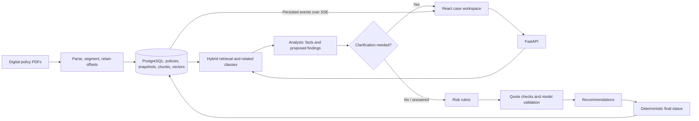
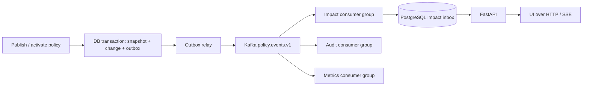

# Clause: capstone review and implementation plan

Prepared 30 September 2026. Presentation horizon: **1–2 days**, as confirmed by the project owner.

This started as an assessment and proposed enhancement plan. The first implementation batch is recorded in section 11 and [the coverage task record](tasks/SESSION_2026-09-30_COVERAGE.md); the remaining roadmap is still proposed work. It supplements the existing `IMPLEMENTATION_PLAN.md`; it preserves the working architecture, the fictional Kestrel Mutual corpus, and the existing scope decisions. Estimates assume one developer familiar with this repository and include focused verification. They are estimates, not delivery guarantees.

## 1. Recommendation

Clause already has a convincing capstone foundation. Its strongest story is: **a business scenario becomes an assessment whose facts, findings, policy versions, citations and specialist handoffs can be inspected**.

For this presentation, finish evaluation and demo readiness, then add one standout feature: an **Evidence Coverage Inspector**. It should expose requirements retrieved but omitted from the model's assessment, and prevent an incomplete assessment from being presented as compliant. This directly addresses an observed failure and gives the reviewer a concrete example of engineering beyond a chat interface.

Kafka is applicable to a later policy-change and background-processing architecture. It is not the best use of these final two days. It cannot fix missed requirements, incorrect policy interpretation or invalid model JSON.

If only one day is available, cut the feature to its smallest useful version and protect time for the real-model walkthrough and evaluation. If the enhancement fails its acceptance checks, present the working core and explain the measured limitation.

## 2. What the assignment actually rewards

Read all four pages of `Project_4_-_AI_Powered_POLICY_COMPLIANCE_INTELLIGENCE.pdf`, including a rendered inspection of the tables and deliverables.

| Requirement and weight | Evidence already in the repository | Main presentation gap |
|---|---|---|
| Policy preparation and knowledge base — 20% | Reproducible synthetic PDFs, manifest hashes, numbered clauses, page offsets, metadata, versioned snapshots | Show a clause beside its original source page; explain the corpus decision |
| Natural-language retrieval and evidence — 25% | PostgreSQL full-text search + local embeddings + pgvector, reciprocal-rank fusion, cited lookup | Show measured hybrid improvement and acknowledge missed clauses |
| Five specialist roles, communication, handoffs, risk and traceability — 25% | Retrieval, analysis, risk, validation, recommendation; persisted typed exchanges; clarification and SSE | Show an actual handoff and validation result, not just the stage animation |
| Evaluation, reporting and application — 20% | Live case workspace, findings, facts, evidence drawer, printable completed-case report, JSON export, evaluation harness | Held-out evaluation and manual evidence-support review remain pending |
| Architecture, design, runnable code and demonstration — 10% | FastAPI service, React app, migrations, tests, CI, README, architecture JPEG/PDF and runbook | Update stale claims and rehearse the eight-minute walkthrough |

The brief asks for an eight-minute demonstration and two minutes of questions. Most of the marks depend on retrieval, analysis and evaluation. An infrastructure addition has value only if it strengthens an observable capability.

Three points need precise wording:

- The brief calls the input a policy/compliance corpus, but its links point to biomedical literature. The documented project decision is Kestrel Mutual: **11 fictional policies, 14 versions, 111 clauses**. Do not claim assessor endorsement or that these were supplied company documents.
- The five roles are functions in one backend, with structured messages. Retrieval and risk are deterministic code; analysis, semantic validation and recommendation use a model. This is an inspectable specialist workflow, not five autonomous servers.
- The brief says A2A communication; the implementation has application-level agent exchanges, **not standardized Agent2Agent interoperability**. The PDF does not explicitly demand the formal protocol. Explain this interpretation and tradeoff; do not invent protocol compliance.

## 3. Technical assessment

### Architecture as implemented



This is sufficient for a local capstone demonstration. FastAPI background tasks execute the workflow; the database saves runs, results, events and agent messages. Startup marks interrupted active runs failed. Completed results survive. There is no durable worker or exact-stage recovery.

### Existing strengths to demonstrate

1. **Provenance:** source spans and citations resolve to stored clause text, source pages and versions. Citation text comes from records, rather than a fabricated model URL.
2. **Temporal correctness:** retrieval filters snapshot membership, organization, published status and effective dates. Data Sharing v2 starts **1 October 2026**, immediately after this review date; this makes version handling easy to explain.
3. **Facts retain uncertainty:** provided, inferred and unknown are separate states. Clarification supports “I don't know.”
4. **Inspectable orchestration:** persisted exchanges and real stage events make the workflow explainable. Show the payload and result of a handoff.
5. **Bounded generation:** stage schemas, repair limits, call budgets and deadlines contain model failures. The organizers' gateway caps replies at 500 tokens, so continuation adds real complexity and latency.
6. **Evaluation integrity:** separate evaluation database, excluded disputed labels, preserved raw runs and input hashes, failures retained in denominators.
7. **Useful presentation polish already exists:** optional reactive avatar, source drawer, requirement matrix, trace, printable report and JSON export. These are not new feature suggestions.

### Findings that deserve attention first

| Priority | Finding | Evidence | Action |
|---|---|---|---|
| P0 | Applicable requirements can disappear from the result | Dev-003 retrieves Data Sharing v2 §4.5 but the model omits it; final rules see only emitted findings | Add coverage accounting and block incomplete clearance |
| P0 | A model can choose an unsupported policy winner | Dev-009 selects precedence between retention policies; semantic validation agrees | Explain the failure; later add reviewed conflict metadata and explicit escalation |
| P0 | Held-out quality is unknown | 20 authored test scenarios await owner review; no final test report exists | Review labels, freeze configuration, then evaluate once |
| P0 | “0 false-compliant” is a narrow metric | `evaluation.py` counts expected non-compliant cases, excluding expected unknown/conflict cases | Also measure unjustified compliant results across every case whose acceptable labels exclude compliance |
| P1 | High evidence scores can accompany wrong conclusions | Latest dev report: 8/11 high-band final results correct | Call the score an evidence-check score in UI and speech; keep the accuracy table beside the claim |
| P1 | Some screens and controls are prototypes | Live router gates reviews/reports/evaluation/settings; hypothetical button is fixture-only | Show only working paths; distinguish the working completed-case print report from the prototype reports index |
| P1 | Documentation contains old architecture/status claims | `PRODUCT.md` still mentions Docker and an unimplemented workflow; some ADRs describe deferred retrieval repair | Align product copy and demo claims with `decisions.md` and code |
| P2 | Single-process execution and demo identity limit deployment | `RunLauncher` uses `BackgroundTasks`; `get_principal` resolves the seeded demo user | Keep local scope for this talk; plan real auth and workers later |

The `requirements`, `jobs`, `reviews` and normalized result tables are not evidence that their corresponding workflows are implemented. Ingestion creates clauses/chunks/relations; it does not currently populate a reviewed executable requirement catalog. Completed assessments are stored as JSON.

### What the measured numbers support

From `docs/evaluation/results-dev.md`, generated 29 September 2026:

| Measurement | Latest saved result |
|---|---|
| Hybrid Recall@10 | 0.839, over 12 scenarios with labelled clauses |
| Keyword-only Recall@10 | 0.704, same scenarios |
| Evidence-bundle recall | 0.856 |
| Final-status accuracy | 9/13 (69%); final tuned runs were 10/13, 10/13, 9/13 |
| Labelled requirement statuses matched | 22/44 (50%) |
| Citation validity | 33/33 |
| Completed / failed | 12 / 1 |
| Median completed-run time | 8.6 seconds |
| High-band final results correct | 8/11 (73%) |

These are development results after prompt tuning, on fictional policies. They are not held-out performance. The hybrid improvement is **0.135 absolute recall**, or 13.5 percentage points; do not describe it as a 13.5% relative gain.

Exact citations establish that text exists. They do not establish that the interpretation is right. Dev-003 and dev-009 both incorrectly return compliant in the latest run, despite “0 of 6 false-compliant” in the narrow breach metric. Those are material errors to discuss openly.

## 4. The one feature to build now: Evidence Coverage Inspector

### User-facing result

Add a coverage section alongside the existing requirement matrix:

> “Retrieved requirement candidates: 7. Accounted for: 6. Unassessed: 1. A compliant result is withheld until the remaining candidate is assessed or its inapplicability is justified.”

Those counts are illustrative product copy, not measurements. Actual counts must come from the saved run.

Each row opens the clause, shows why retrieval included it, and shows one of:

- assessed, with finding and support state;
- explicitly not applicable, with validated rationale;
- unassessed, with a visible coverage warning.

Use “coverage of retrieved candidates,” not “all policies covered.” Retrieval can still miss requirements. A missing model finding is not automatically a violated rule or an unknown business fact.

### Smallest implementation

**Estimate: 4–6 hours including focused tests.** No new database table, worker, provider or public endpoint is necessary.

1. Add `workflow/coverage.py`. Start with retrieved `requirement` and `exception` clauses as candidates. Account for them by finding `requirement_id` after validation. A citation mentioning a clause is not enough to account for its requirement.
2. Include cited candidates with pending/unsupported/contradicted findings as unresolved; a validated `not_applicable` finding is an explicit disposition. Keep definitions as context, not checklist obligations.
3. Clause-kind classification is heuristic. General clauses can still impose obligations: for example, “are retained … then deleted” may not match the ingestion regex. Review the candidate classification against the policy texts; if necessary use a small documented corpus metadata override, **derived from policy text, never evaluation answers**. Otherwise disclose the inspector's restricted coverage rather than claiming completeness.
4. Add an optional `coverage` object to the assessment contract: candidate count, accounted count, unresolved clause IDs, and rows containing clause/version IDs, heading, retrieval reason, finding IDs, coverage state and source reference. Distinguish unsupported findings from completely omitted clauses.
5. Compute coverage after semantic validation, before final publication. Preserve established breaches and conflicts. If the derived status would be `compliant_within_scope`, but candidates remain unresolved, publish `insufficient_information` with a coverage-specific explanation. Do not claim that a business fact is missing when the model simply omitted a clause. Likewise, do not assert `out_of_scope` solely because no finding was emitted while requirement candidates remain unresolved.
6. This is a deliberately conservative gate. Unrelated retrieved requirements may increase abstention. Use the current analysis output's validated `not_applicable` status to justify exclusions; do not equate all retrieval hits with applicable obligations.
7. Persist coverage in the final assessment JSON and emit compact counts in the existing validation handoff/event payload. Old results with no coverage object say “coverage not recorded,” not “complete.”
8. Add `CoverageInspector.tsx` to the case result. Reuse clause preview/source controls and extend print/JSON output. Use the existing typography and status language.
9. Export OpenAPI and update TypeScript contracts, fixtures and relevant contract checks together. Version the new gate behavior in run configuration; keep prior raw evaluation outputs intact.
10. Keep the existing evidence score, but change visible wording from “confidence in this result” to “evidence checks.” Do not invent a calibrated probability or award points for coverage without measurement.

Touch points: `app/domain/contracts.py`, `workflow/orchestrator.py`, `workflow/outcome.py`, `workflow/confidence.py` where explanation handling requires it, `apps/web/src/lib/api/types.ts`, `features/cases/Assessment.tsx`, `PrintReport.tsx`, shared fixtures and the exported OpenAPI contract.

### Acceptance checks

- A retrieved v2 §4.5 omitted by a scripted model appears as unassessed and cannot produce a compliant result.
- The same scenario on 30 September uses v1; on 1 October it uses v2. No draft or out-of-date clause enters the checklist.
- A validated exception can make the replaced requirement not applicable; it is not counted as a breach.
- A clause merely quoted in another finding does not count as assessed.
- Unsupported findings and omissions have distinct explanations.
- An established violation remains non-compliant despite incomplete coverage elsewhere.
- Old results remain readable, exportable and printable without fabricated coverage.
- Keyboard and avatar-disabled operation work; reload shows the same persisted counts.
- Development evaluation records changes in both unjustified clearance and cautious abstention. More refusals alone are not evidence of improved overall accuracy.

Timebox this. Do not add a second LLM stage or general rule language in the final day. If candidate applicability makes the gate unusably broad, ship the inspector as a diagnostic feature, keep the measured limitation visible and defer automatic gating rather than pretending it solves completeness.

## 5. Delivery order for the next 1–2 days

| Order | Work | Budget | Completion evidence |
|---|---|---|---|
| 1 | Real-model smoke run in live UI: submit, clarify, cite, reopen and print | 1–1.5 h | Saved completed case; observed working path and provider error handling |
| 2 | Fix metric wording, add unjustified-compliance metric, align stale documentation | 0.5–1 h | Accurate results definitions and no unsupported demo claims |
| 3 | Implement and verify Coverage Inspector | 4–6 h | Focused checks above plus one live-model example |
| 4 | Run dev regression; review evidence support and owner-review held-out labels | 1.5–2.5 h | Labels reviewed/disputed with notes; prompt and code configuration frozen |
| 5 | Single held-out run after freeze; inspect failures and preserve raw outputs | 0.5–1 h | Honest final report, including failures and manual-review status |
| 6 | Save demo examples, record fallback, rehearse twice and freeze changes | 1.5–2 h | Eight-minute run; source/evaluation/architecture tabs ready |

Total: approximately **9.5–14 hours**. Do not add another major feature after step 3.

For one day: do step 1 first, limit inspector work to three hours, retain evaluation and rehearsal time, and defer extras. If held-out review cannot be completed, present dev results clearly as dev and say held-out evaluation is pending; do not mark labels reviewed by script or fabricate a report.

For two days: finish the inspector and focused regression on day one; finish label review, final evaluation and presentation preparation on day two. Do not tune against held-out outputs after the final run. New tuning requires a new independent evaluation set.

### Evaluation additions

Define `unjustified_compliant` as a completed prediction of `compliant_within_scope` when that status is absent from the scenario's acceptable labels. Report its count and eligible denominator, alongside the existing false-compliant-on-breaches metric. Report conflict and missing-information mistakes separately.

Keep retrieval recall, requirement-status match, citation validity, final status, failures and median latency. Add the inspector's unresolved-candidate counts. Manual review should assess whether decisive evidence supports the conclusion, not only whether the quote matches. The held-out set has no genuine conflict case; report that coverage gap and use the known dev conflict only as a development demonstration.

## 6. Extra features worth building after the presentation

These are separate choices, not commitments to implement all of them in two days. Estimates include focused testing but not public deployment.

| Feature | Reviewer-visible payoff | Estimate | Priority |
|---|---|---|---|
| Policy date comparison | Same facts, different dates, different applicable clauses | 1–2 days | Best next showcase feature |
| What-if comparison | Show which requirements change when the requester changes facts | 1–2 days | Strong practical feature |
| Human review with audit history | A reviewer challenges a finding with rationale; original model output remains | 1–2 days | Strong credibility feature |
| Policy-change impact inbox | Identify previous cases potentially affected by new obligations | 2–4 days | Best business use case for event processing |
| Retrieval/evaluation dashboard | Explain rank channels, omissions, failures and repeatability | 0.5–1.5 days | High value; reuse existing measurements |
| Durable worker and checkpoint recovery | Restart during an assessment and recover predictably | 2–4 days | Operational depth |
| Reviewed conflict/rule catalog | Detect known policy collisions and enforce explicit precedence | 2–4 days | Correctness before infrastructure |
| OCR/DOCX import with review | Bring a new policy through extraction, source inspection and publication | 2–4 days | Only if broader documents are needed |

### A. Policy date comparison

Reuse version filtering and `VersionDiff.tsx`. Add a date-comparison command that creates two independent runs with identical scenario text and two explicit `as_of` dates, pinned to the same selected snapshot. Return child run IDs immediately and use existing progress subscriptions; do not block an HTTP request while two assessments finish.

Compare findings by `(policy_id, logical clause_key)`, not random finding IDs or version-specific clause IDs. Include added/removed clauses and unchanged requirements whose result changes. Preserve both originals. Verify the 30 September/1 October Data Sharing transition and a draft-version exclusion. “Assessed on” and “policy effective date” must remain distinct.

If needed, add a small run-comparison endpoint/record; the current create-case API already accepts an assessment date, so the first version can use two cases without inventing an entire branch engine. A reliable paired walkthrough using existing dates is possible without shipping a new comparison screen.

### B. What-if comparison

`Hypothetical.tsx` currently uses vendor-specific fixture changes. `httpApi.createBranch` names `/cases/{id}/branches`, but no backend route implements it. This needs real backend work, not just revealing the button.

Create an immutable hypothetical revision/run from user-entered changes, preserve the original facts and assessment, and label the result hypothetical everywhere. Explicit changed facts must override the corresponding source fact; simply appending “now approved” to a scenario saying “not approved” leaves a contradiction. Return a queued run, then subscribe through SSE. Replace fixture changes with an editable form and compare by logical requirement keys. Verify baseline preservation, explicit overrides, unresolved facts and failure isolation. Do not promise a mathematically minimal remediation plan.

### C. Human review

Use `Review` persistence and `ReviewQueue.tsx`, with a real `POST /runs/{run_id}/reviews` implementation and query paths. Require completed run, organization access, disposition, rationale and reviewer identity; store append-only decisions. Display the assessment separately from the person's disposition. Acceptance: challenging a citation does not rewrite the AI's findings, survives reload and is blocked across organizations. Production identity remains a separate prerequisite; a seeded demo admin is not real authentication.

### D. Policy-change impact inbox

Create an explicit publish/activation workflow: validated indexed version, immutable new snapshot, policy change record and clause diff. Distinguish publication now from a future effective date. At activation, compare prior and new obligations.

Find potentially affected cases using cited policy/clause dependencies, then broaden using stored business area/scope for newly added rules: a new clause cannot have old citations. These are candidates for reassessment, not proven non-compliant cases. Show changed clause and previous result. Reassess only on an explicit action, create a new run/snapshot and retain the earlier result.

Acceptance: one activated change creates one impact entry per affected case; new clauses and effective dates are handled; unrelated cases are excluded where justified; old assessments remain unchanged. Begin with a PostgreSQL job worker. Add Kafka only when several independent consumers justify it.

### E. Retrieval and evaluation dashboard

Return measured saved evaluation reports through a read-only API; connect the prototype evaluation screen to those artifacts. Show split, sample size, hashes, model/prompt versions, completion failures, confusion matrix, retrieval channels and evidence-support review status. Expose lexical/dense ranks already returned by search. Do not show cosine or reciprocal-rank scores as confidence probabilities. Verify that regeneration preserves history and that no expected answers enter prompts.

### F. Durable execution

Move `execute_run` behind a PostgreSQL-backed worker using jobs, transactional claims, leases, heartbeats and bounded retries. Persist typed stage outputs/checkpoints separately from browser progress events. Clarification waits release work rather than hold a worker indefinitely. Check cancellation before publishing and fence expired attempts so a stale worker cannot overwrite a newer result.

Acceptance: terminate the worker after validation, restart, and recover from a saved checkpoint; duplicate job delivery produces one final result; stale attempt publication is rejected. Replaying saved progress events is not execution recovery. A crashed model request may need repeating and incur extra cost; document that boundary.

### G. Reviewed conflict and threshold metadata

Populate a small policy-derived requirement catalog with reviewed applicability, numeric/time constraints, explicit exception relations and any precedence stated by the policy. Model-extracted rules remain proposed until reviewed. For the retention conflict, store reviewed potential-conflict relationships; determine whether the scenario activates both obligations before escalating. Shared keywords or a known relation alone do not establish a conflict.

Use a narrow allowlisted evaluator for dates, amounts and approvals; compare structured supplied facts, preserve unknowns, and attach original clauses. Never hardcode evaluation case IDs or invent precedence. Acceptance: boundaries, unit conversion, exceptions, missing facts and unresolved conflicts each have meaningful checks. Formal A2A support can be an independent adapter later if the reviewer requires it; Kafka does not provide that protocol.

### H. Document ingestion expansion

Add draft upload, extraction job and page/source inspection before publication. OCR needs actual page coordinates and visible extraction warnings; do not fabricate highlights from guessed bounds. DOCX needs stable paragraph/section references and an explicit source representation. Use separate document fixtures, verify malformed/oversized input and keep low-quality extraction out of active snapshots until reviewed.

## 7. Is Kafka applicable?

**Yes, for durable domain events consumed by multiple independent services.** Apache Kafka provides retained event streams, independent consumers and ordered processing within a partition. That supports policy activation, impact analysis and operational reporting. See [Apache Kafka introduction](https://kafka.apache.org/43/getting-started/introduction/).

For this app, a good product story is: **“When a new policy becomes effective, impacted cases appear for review while audit and analytics consume the same event independently.”**

| Need | Current / smaller option | When Kafka adds value |
|---|---|---|
| Browser stage progress | Persisted run events + SSE | SSE still serves the browser; Kafka is optional upstream infrastructure |
| One background assessment worker | PostgreSQL jobs with leases | Many workers/services and a retained integration stream |
| Policy activation notifications | Transactional outbox + worker | Impact, audit and analytics each need independent consumption/replay |
| Specialist communication inside one run | Typed function handoffs | No clear benefit from splitting every stage into a broker consumer |

### Concrete later implementation

**Estimate: 2–4 additional days after publication/impact and durable job primitives exist.** Start with a single-broker development profile; this demonstrates wiring, not production fault tolerance.



1. Persist `outbox_events` with policy state in the **same PostgreSQL transaction**. A separate relay publishes and marks delivery. Avoid an unsafe database write followed by a best-effort Kafka publish.
2. Use `policy.events.v1` for `policy.version.published` and `policy.version.activated`; key by organization + policy ID. Add `assessment.events.v1`, keyed by run ID, only if a real consumer needs it. Ordering is within a partition, not global across policies/topics.
3. Event envelope: event ID, schema version, event type, organization ID, aggregate ID/version, occurrence time, correlation ID and small ID-based payload. Keep sensitive scenario text and documents in controlled storage.
4. Give impact, audit and analytics separate consumer groups. Use a processed-event table with a unique `(consumer, event_id)` key. Apply database effects and record consumption atomically; acknowledge Kafka offsets after the database transaction succeeds. Relay crashes can publish duplicates, so idempotent consumers are required.
5. Add bounded retries, dead-letter handling, lag/error visibility and a retention policy. Guard against stale aggregate versions; retry topics can reorder work even when the source partition is ordered.
6. On duplicate policy events, create one impact record. On broker failure, the saved policy change and outbox remain and delivery resumes. On a future-dated publication, do not mark current cases affected as if the policy were already active.
7. Demonstrate broker downtime, consumer restart and duplicate delivery with persisted outcomes. Keep completed historical assessments immutable.

Kafka transactions do not automatically make PostgreSQL writes or external LLM calls exactly once. The external-system boundary needs application coordination and idempotency. See [Apache Kafka delivery semantics](https://kafka.apache.org/43/design/design/).

The defensible reviewer answer today is: “I kept the demo on FastAPI and PostgreSQL. Kafka becomes useful when policy changes feed independent impact, audit and analytics consumers. The proposed migration uses a transactional outbox and idempotent consumers.”

## 8. Presentation plan

Lead with a business problem and a result the reviewer can verify. Keep the avatar enabled only if it runs smoothly; evidence should occupy most of the screen.

| Time | Show | Point |
|---|---|---|
| 0:00–0:45 | Policy library and one scenario | What the employee needs to decide; fictional corpus scope |
| 0:45–1:30 | Clause, version and original PDF page | Evidence provenance and effective date |
| 1:30–3:15 | Real assessment and clarification | Live handoffs; unknown facts are not guessed |
| 3:15–4:15 | Findings, recommendation and source drawer | Trace a decision from stated fact to requirement to action |
| 4:15–5:15 | Coverage inspector, if delivered | Show the omitted-candidate problem and actual handling |
| 5:15–6:15 | Trace + system/workflow diagram | Explain which stages use models, which use code and why |
| 6:15–7:15 | Measured report and one failure | Hybrid improvement, held-out status and evidence-support limits |
| 7:15–8:00 | Completed-case print report and architecture tradeoff | Saved useful output; explain why Kafka is a later step |

If the inspector is not ready, use that minute to demonstrate the existing policy version diff or a changed-facts rerun, showing only verified behavior. Select a dev example for the demo; do not use held-out examples to tune the system.

Prepare a saved real result and a short recording. If a provider request fails, open the saved result and identify it as a previous run. Never replace a live failure with an unlabeled fixture.

### Questions to prepare

- **Why hybrid search?** Keyword matches and semantic matches complement each other; show the measured 0.839 versus 0.704 Recall@10 on this dev corpus.
- **What did you build beyond model calls?** Clause/source extraction, date/snapshot filtering, structured facts/findings, bounded orchestration, citation checks, deterministic status rules, persistence, evaluation and the UI.
- **Does validation guarantee correctness?** No. Text checks establish provenance; a second model can agree with a wrong interpretation. Show the known conflict error and planned reviewed rules.
- **Is 100/100 confidence a probability?** No. It is an evidence-check score; the measured high-band accuracy is lower.
- **Are these independent agents?** Specialist functions with typed persisted handoffs; three stages use model calls. Explain the bounded workflow and the formal-A2A distinction.
- **Why no Kafka?** Current workload does not need independent stream consumers. Describe policy activation and the outbox migration when that need appears.
- **What happens on restart?** Completed results persist; active runs currently fail clearly. Durable checkpoint recovery is planned, not implemented.
- **Can this be deployed publicly?** Real authentication and deployment safeguards must precede it; current demo identity is local scope.

## 9. Release checks and stop conditions

After implementation, use the existing checks from the repository:

```powershell
# services/api
uv run ruff check app tests ../../scripts
uv run mypy app
uv run pytest
uv run python -m app.cli export-openapi --check

# repository root
corepack pnpm --dir apps/web typecheck
corepack pnpm --dir apps/web test
corepack pnpm --dir apps/web build
corepack pnpm --dir apps/web exec playwright test
```

Check focused coverage cases first, then the required existing suite. Database-backed checks must run with PostgreSQL available; skipped integration checks are not a full pass. Keep new code out of the demo if it breaks contracts, blocks the primary scenario, fabricates coverage for old runs or fails to preserve original results. Reserve the final hours for rehearsal rather than another architecture change.

The analysis turn is not a new real-model benchmark: it does not consume the lab key, run the held-out set, review labels on the owner's behalf or implement the proposed features.

Checks executed during this review, against the current working tree:

| Check | Result |
|---|---|
| Frontend TypeScript check | Passed |
| Frontend Vitest suite | 30 tests passed across 7 files |
| Backend `pytest -m 'not db'` | 156 passed; 58 deselected; one Alembic configuration deprecation warning |
| Database-marked integration tests | Not run in this review |
| Browser end-to-end tests, production build, new real-model evaluation | Not run in this review |

These checks establish a useful baseline, not the correctness of the proposed enhancements or the model's policy interpretations. Existing user changes were preserved; this review adds this plan without rewriting the prior implementation plan.

## 10. Source map

- Original brief: `Project_4_-_AI_Powered_POLICY_COMPLIANCE_INTELLIGENCE.pdf`, pages 1–4.
- Current setup/scope: `README.md`, `IMPLEMENTATION_PLAN.md`, `docs/architecture/decisions.md`.
- Corpus: `docs/data/corpus-decision.md`, `data/demo/policies/`.
- Retrieval: `services/api/app/retrieval/search.py`, `workflow/retrieval.py`.
- Workflow: `workflow/analysis.py`, `risk.py`, `validation.py`, `outcome.py`, `confidence.py`, `orchestrator.py`.
- Runtime/persistence: `api/cases.py`, `api/deps.py`, `persistence/models.py`, `main.py`.
- Metrics/limits: `docs/evaluation/results-dev.md`, `analysis.md`, `data/evaluation/README.md`, `app/evaluation.py`.
- Live/prototype boundaries: `apps/web/src/app/router.tsx`, `lib/api/httpApi.ts`, `features/cases/CaseWorkspace.tsx`, `Hypothetical.tsx`, `features/review/ReviewQueue.tsx`.
- Existing presentation: `docs/presentation/README.md`.

No numeric grade or general accuracy claim is justified by this repository review. The strongest impression will come from a reliable demonstration, inspectable evidence and a clear explanation of a measured failure you have addressed.

## 11. Implementation update: 30 September 2026

Delivered the Evidence Coverage Inspector and the associated evaluation metrics. New assessments persist one coverage row per retrieved candidate, expose source text and page links, distinguish omissions from disputed findings and validated exclusions, and include coverage in the validation handoff, JSON export and printable report. Unresolved candidates block clearance while established breaches and conflicts retain precedence. Older saved assessments explicitly show that coverage was not recorded.

The analysis-v3 prompt now receives a candidate checklist and must provide an assessment or justified exclusion for each entry. Candidate selection uses the dated, pinned evidence, clause kinds and a reviewed policy-derived catalog; it does not use scenario labels. UI labels now call the existing confidence measure an evidence score. The browser suite uses a separate fixture server on port 5174 so tests cannot attach to the live demo on 5173.

Verification: **235 backend tests, 36 frontend unit tests and 24 browser tests passed**. Backend lint and types, frontend types, the OpenAPI freshness check and the production build passed. Browser checks covered desktop/mobile layout, keyboard disclosures and complete print output. A real-model HTTP smoke check also passed through case creation, clarification, completion, saved coverage, source-page redirect and SSE events using a temporary API and the separate evaluation database. Existing Alembic configuration and large frontend bundle warnings remain.

Two development runs were made with the already-configured Claude Sonnet 5.5. The gate alone was too conservative: 9/13 final statuses correct, three cautious misses, and unresolved coverage in every run. With the checklist, the latest result was **12/13**, **0 unjustified compliant results across 9 eligible scenarios**, **136/136 valid citations**, one cautious miss and one unresolved candidate. The previously omitted v2 retention requirement was explicitly assessed as unknown. Median run time was 21.4 seconds. [Results](evaluation/results-dev.md) and [analysis](evaluation/analysis.md) preserve the measured tradeoff.

These are development observations after prompt adjustment. The provider differs from the earlier GPT-4o mini baseline, so the improvement cannot be attributed solely to the gate. Evidence-support review, owner review and the held-out run remain pending. Kafka, date comparison, durable workers and the other feature ideas remain roadmap items. Start a fresh live assessment to demonstrate coverage; historical results are deliberately not backfilled.
